	   杭州房产知识扫盲
	   -- 图片来自网络，如侵权删
	   -- 数据不保证完全准确，有些错误的地方海涵，有错误的请自己求证。
	   -- 买房有风险，投资需谨慎 资料内融不能完全正确，还往谨慎。
	   
* ###   [新增各地控规文件](#新增各地区控规文件)

*   [一：认识杭州从板块说起](#id-杭州房产-一：认识杭州从板块说起)
    *   [1.房产板块划分图](#房产板块划分图)
    *   [2.杭州行政区域主城区](#杭州行政区域主城区)
    *   [3.杭州其他区域行政划分](#杭州其他区域行政划分)
    *   [4.19大后杭州的重点建设区域划分和定位](#19大后杭州的重点建设区域划分和定位)
    *   [5.两个主中心](#两个主中心)
    *   [6.七大城市副中心](#七大城市副中心)
    *   [7.2017年杭州各板块地王及楼面价地图](#2017年杭州各板块地王及楼面价地图)
    *   [8.2017年杭州各板块房价地图](#2017年杭州各板块房价地图)
    *   [9.2017年杭州热门板块和最高地价参考图](#2017年杭州热门板块和最高地价参考图)
    *   [10.2018年各板块楼市供应库存](#2018年各板块楼市供应库存)
*   [二：关于房子要知道的一些概念](#关于房子要知道的一些概念)
    *   [1.用地性质](#用地性质)
    *   [2.容积率](#容积率)
    *   [3.买房时定金 订金 诚意金 认筹金 区别](#买房时定金订金诚意金认筹金区别)
    *   [4.绿化率多少合适 住宅小区绿化率标准](#绿化率多少合适住宅小区绿化率标准)
    *   [5.楼层净高](#楼层净高)
    *   [6.为什么每层住宅楼层默认高是在 3 米左右？](#为什么每层住宅楼层默认高是在3米左右？)
    *   [7.杭州2017年的现房销售政策](#杭州2017年的现房销售政策)
    *   [8.3分钟！搞定杭州人才居住证！](#3分钟！搞定杭州人才居住证！)
    *   [9.买房选择东边套 西边套 还是中间套？](#买房选择东边套西边套还是中间套？)
    *   [10.公摊面积](#公摊面积)
    *   [11.房子如何买及首付要求](#房子如何买及首付要求)
    *   [12.二手房购买攻略](#房子如何买及首付要求)
*   [三：杭州开发商信息与对比(还没写)](#杭州开发商信息与对比)
*   [四：杭州房产信息渠道](#杭州房产信息渠道)
    *   [1.透明售房网](#透明售房网)
    *   [2.口水楼市](#口水楼市)
    *   [3.19楼房产](#19楼房产)
    *   [4.公众号](#公众号)
    *   [5.政府网站](#政府网站)
    *   [6.一些QQ群](#一些QQ群)
*   [五：地铁交通规划与现状](#地铁交通规划与现状)
    *   [1.目前的杭州地铁(2017)](#目前的杭州地铁)
    *   [2.杭州三期地铁(2022)](#杭州三期地铁)
    *   [3.杭州地铁3期线路图](#杭州地铁3期线路图)
    *   [4.当前杭州交通地图](#当前杭州交通地图)
    *   [5.当前杭州交通地图](#杭州市轨道交通远期建设规划)
    *   [6.规划局杭州道路交通规划图2017版](#规划局杭州道路交通规划图2017版)
    *   [7.综合交通枢纽体系图](#综合交通枢纽体系图)
    *   [8.“杭州中环”2018年开工](#2018年开工)
    *   [9.杭州水上巴士](#杭州水上巴士)
    *   [10.亚运场馆建设](#亚运场馆建设)
*   [六：拆迁](#拆迁)
    *   [1.三改一拆是什么](#三改一拆是什么)
    *   [2.2018拆迁大幕-主城要拆4万户、萧山8000户、临安1500户](#2018拆迁大幕-主城要拆4万户、萧山8000户、临安1500户)
    *   [3.2018年棚户区改造计划(第三批)](#2018年棚户区改造计划)
    *   [4.主城区城中村改造五年（2016-2020）攻坚行动计划](#主城区城中村改造五年)
    *   [5.2017年主城区拆迁表](#2017年主城区拆迁表)
    *   [6.余杭区2017-2019年城中村改造示意图](#2019年城中村改造示意图)
    *   [7.杭州各区拟订2018 年“三改一拆”旧住宅区改造计划 ](#杭州各区拟订2018)
*   [七：2017-2021年杭州市区住宅用地供应中期规划汇总表](#2017-2021年杭州市区住宅用地供应中期规划汇总表)
*   [八：土拍分析](#土拍分析)
    *   [1.透明售房网-杭州土地市场分析](#透明售房网-杭州土地市场分析)
    *   [2.近一年土地成交档案](#近一年土地成交档案)
*   [九：2020年人口目标](#2020年人口目标)
*   [十：杭州重点发展项目](#杭州重点发展项目)
*   [十一：杭州市政规划](#杭州市政规划)
*   [十二:关于学区](#关于学区)
    *   [1.分表制度](#分表制度)
    *   [2.学区划分](#学区划分)
*   [十三: 配套设施分析(道路，医院，学校，综合体)](#配套设施分析)
    *   [1.综合体](#综合体)
    *   [2.学校](#学校)
    *   [3.医院](#医院)
*   [十四: 各区域详细规划与价值分析](#各区域详细规划与价值分析)
    *   [1.上城区](#上城区)
    *   [2.下城区](#下城区)
    *   [3.西湖区](#西湖区)
    *   [4.江干区](#江干区)
    *   [5.下沙](#下沙)
    *   [6.良渚新城](#良渚新城)
    *   [7.智慧网谷小镇](#智慧网谷小镇)
    *   [8.未来科技城金融岛](#未来科技城金融岛)
*   [十五:关于买房的几张图](#关于买房的几张图)
*   [十六:如果觉得不错随便赞赏下](#如果觉得不错随便赞赏下)

## <a name="id-杭州房产-一：认识杭州从板块说起">一：认识杭州从板块说起</a>

### 1.<a name="房产板块划分图">房产板块划分图</a>

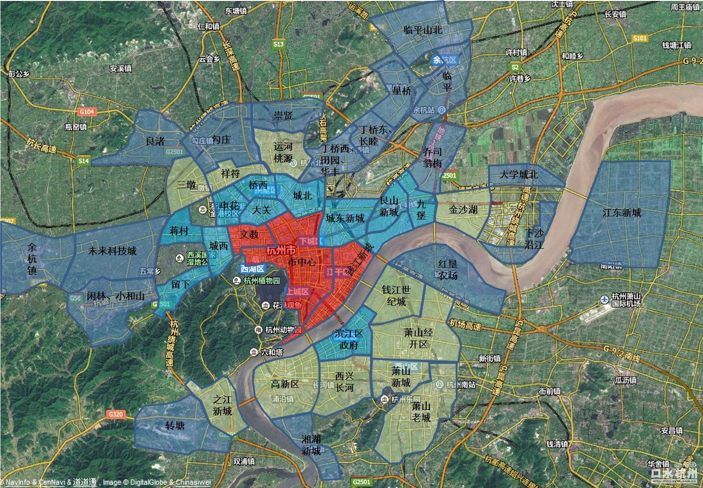

### 2.<a name="杭州行政区域主城区">杭州行政区域主城区</a>

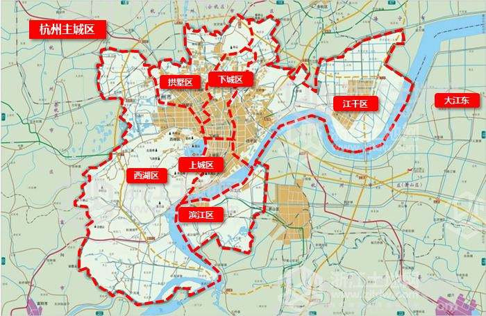

### 3.<a name="杭州其他区域行政划分">杭州其他区域行政划分</a>

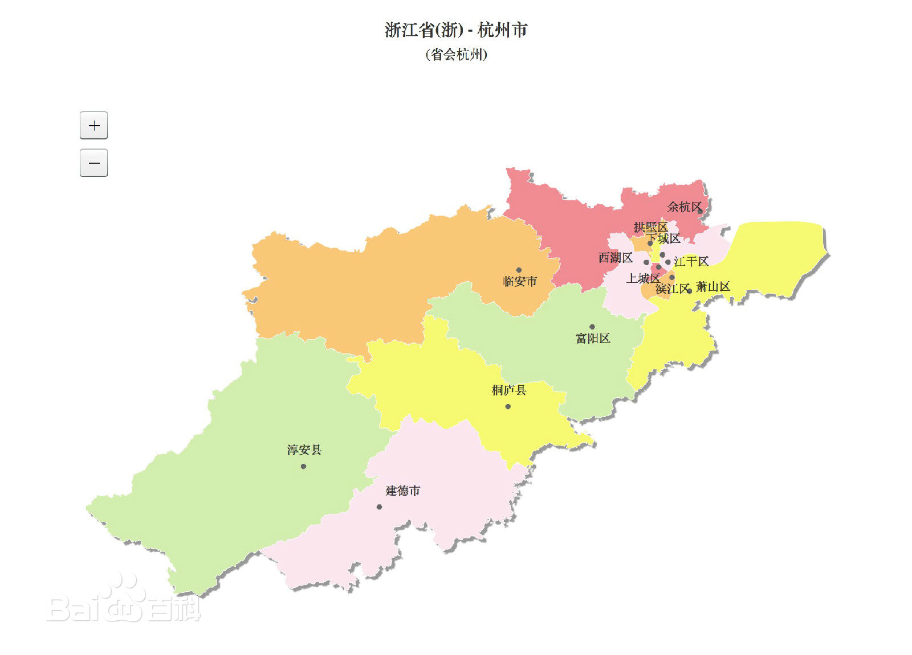

经国务院批准和浙江省人民政府批复同意，杭州市人民政府驻地由拱墅区环城北路318号迁至江干区解放东路18号（邮编：310026）。迁址后原办公电话不变。

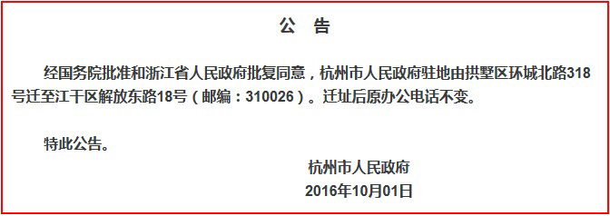

### 4.<a name="19大后杭州的重点建设区域划分和定位">19大后杭州的重点建设区域划分和定位</a>

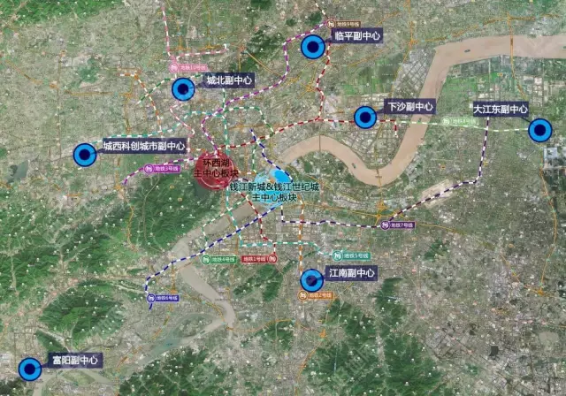

### 5.<a name="两个主中心">两个主中心</a>

“十三五”期间，杭州市楼宇经济构筑的两个主中心，即环西湖主中心板块和钱江新城、钱江世纪城主中心板块，这是杭州市楼宇经济发展的核心板块。

杭州市楼宇经济将构筑“两主七副多点”的空间格局。

其中，**钱江新城和钱江世纪城主中心板块，发展定位为杭州市的政治、经济、文化新中心和钱塘江金融港湾核心区。**
> 1 环西湖主中心板块** **

**区域：**覆盖中河路以西、环城北路—天目山路以南、河坊街以北的环西湖地区，包括庆春——凤起板块、武林板块、湖滨板块、吴山板块和黄龙板块** **

**发展定位：**市级休闲游憩商业核心区（RBD），重点发展商贸流通、文化娱乐和休闲旅游等产业

**目标：**展示杭州历史文化气质和国际化形象
> **_2 _**钱江新城和钱江世纪城主中心板块

**区域：**由钱江新城和钱江世纪城两个区域组成

**发展定位：**杭州市的政治、经济、文化新中心和钱塘江金融港湾核心区 

**目标：****钱江新城**要打造集行政、商务、金融贸易、信息会展、文化旅游和居住等功能于一体的高端商务服务中心

**钱江世纪城**重点吸引国内外大企业总部、跨国集团地区分部、金融保险机构、会议展览、现代物流和咨询中介等现代服务业机构，

 **打造总部经济高度集聚、具有鲜明金融商贸特征的中央商务区。**

### 6.<a name="七大城市副中心">七大城市副中心</a>

七大城市副中心，作为楼宇经济发展的重点建设集聚区，分担主城区人口、产业和服务功能，形成区域协调发展的空间格局。

分别为**江南副中心、下沙副中心、临平副中心、大江东副中心、城西科创城市副中心、城北副中心、富阳副中心。**
	

	                        
	            

	                         1 城北副中心

**区域：**以勾庄一带为核心，由运河新城、北部新城核心区组成，辐射良渚组团、瓶窑组团

**发展定位：**以商业、商务和文化为主导功能，打造集生活居住、商务办公、商贸物流、旅游休闲、文化创意、总部经济为一体的城市北部楼宇经济示范区
> **_2 _**城西科创城市副中心

**区域：**以未来科技城和青山湖科技城为核心，辐射临安东部、余杭西部等区域

**发展定位：**重点发展信息经济、生物医药、新材料、科创服务和文化创意等产业
> **_3 _**江南副中心** **

**区域：**由滨江区、萧山城区和江南临江区块组成** **

**发展定位：**打造以高新研发、商业商务和居住为主导的现代化智慧城区和远景商务中心** **
> **_4 _**富阳副中心

**区域：**以鹿山新城、银湖新城等为重点区块

**发展定位：**大力发展文化创意、科技研发、金融服务、信息技术和总部经济等，打造杭州西部总部楼宇经济示范区
> **_5 _**大江东副中心

**区域：**由江东新城、临江新城、空港新城和前进工业园区四大片组成

**发展定位：**大力发展智能制造业、现代服务业等高技术产业，打造以先进制造业为主导的都市工业型楼宇经济示范区
> **_6 _**下沙副中心

**区域：**以杭州经济开发区和高教园区为骨干区域** **

**发展定位：**以高新技术产业和先进制造业为基础，打造集教育、科研、商务和居住等功能于一体的复合型楼宇经济示范区
> 7 临平副中心

**区域：**由临平新城、钱江科技城、九乔商贸城、塘栖新城、崇贤新城以及老城区等板块组成

**发展定位：**融总部商务、商业金融、文化展示、旅游休闲和高端居住等于一体的生态智慧型楼宇经济示范区
### 7.<a name="2017年杭州各板块地王及楼面价地图">2017年杭州各板块地王及楼面价地图</a>
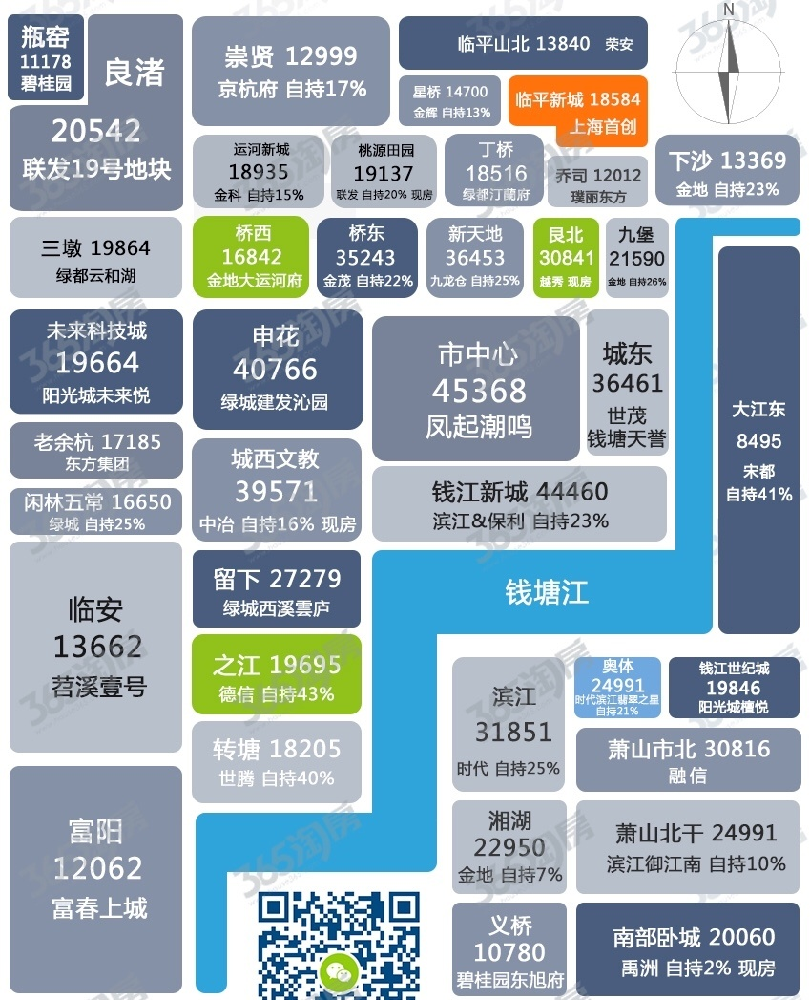
### 8.<a name="2017年杭州各板块房价地图">2017年杭州各板块房价地图</a>
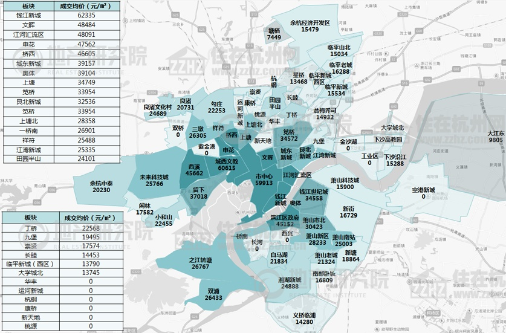
### 9.<a name="2017年杭州热门板块和最高地价参考图">2017年杭州热门板块和最高地价参考图</a>
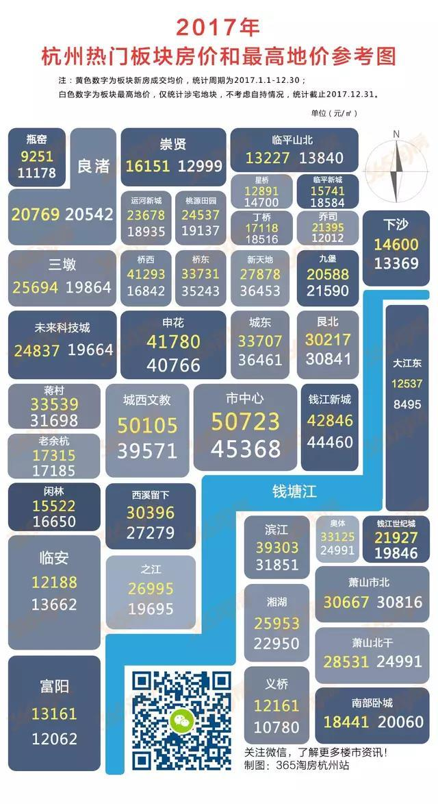
### 10.<a name="2018年各板块楼市供应库存">2018年各板块楼市供应库存</a>
  2018杭州在售120余盘预计还有6万多套的供应量，而100来个新盘以及地块预计今年将有1000多万方的房源将会入市。其中余杭、萧山板块不管是在售楼盘量还是后续的供应量占比依旧比较大，仍是2018年的供应主力。而上城、下城、滨江依然是不管是续销房源还是和后续的板块供应，都捉襟见肘，板块内房源供应紧张。
  从续销楼盘看来，2018年万元房占比38%，占比依旧比较大。但是从房源分布上来看，1字打头的楼盘多分布在大江东、临平、崇贤、闲林以及、富阳、临安几个距离主城区较为偏远的地方，原先的丁桥、下沙、九堡等传统意义上的万元房板块已消失。
  续销楼盘中万元盘虽然占比较大，但是 2016年以来，土地市场就较为火热，各个板块楼面价都创新高，临平、闲林楼面价已经突破1万7，开发商的拿地成本越来越高。在下面表格中，我们可以看出，后续将供应的楼盘中，楼面价在万元以内的仅占13%。即使是为了保本，未来开发商也必须提高房价，所以在即将入市的新盘中万元盘会却越来越少。而随着临平、闲林等板块楼面价攀升，这两个区域也将逐渐退出万元盘板块。
  城东新城和艮北新城作为改善购房者所热衷的板块，随着大批楼盘的相继售罄，一直经历着房荒的困扰。而今年，城东新城板块除了万科中央公园、淮矿东元府、新天地金色时光会相继推出剩余房源，世茂钱塘天誉也已经具备了申领预售证的条件，三湘印象、金茂、淮矿分别拿下的3宗宅地预计今年也会面世。

  艮北新城地铁绿城杨柳郡和杭实天成府均有1000多套的库存量，另外，润和武林郡，招商公园1872和越秀的一宗宅地预计今年将入市，缓解板块内的库存紧张状况。

  除了城东新城和艮北新城改善购房者选择的余地增多，近两年比较热门的萧山城区板块选择的余地依旧很大，除了在售的13个项目将近4000套房源，后续预计还有十余个新盘即将加推。是钱江南岸改善房源较为集中的一个板块。

  另外，运河新城作为规划中的城北城市副中心房荒已久，去年金科拿下的2宗宅地将填补一直以来运河新城在新房市场上的空白。而从楼面价来看，未来这个板块将是改善购房者的一个新选择。
  2018年，不管是武林新城、钱江新城、奥体还是申花板块都将迎来新的房源注入，大批豪宅入市，也让高端改善人群选择性增多。

  作为传统意义上的豪宅聚集区，钱江新城不仅有华联钱塘公馆以及去年年底刚入市的信达滨江壹品，滨江保利翡翠海岸也将在本月中下旬入市，中海钱江湾、金隅中铁景芳地块项目的入市，将为板块的豪宅注入新活力。

  武林新城朗诗乐府、朗诗熙华府、首开武林8栋还会有新房源加推，但是也仅有300余套房源，后续供应量短缺。

  申花板块作为近两年新崛起的豪宅板块，不管是在售房源还是后续供应量都比较充足，目前板块内合景天銮、融信公馆ARC、融创宜和园、首开杭州金茂府都将有比较多的房源相继加推。而后续融信庆隆地块、绿城建发沁园预计也会在今年面世，但是从两个项目的楼面价都突破了4万+来看，开发商为了保本，开盘房价或突破6万。

  总体来说，由于近两年来土地供应加大，楼市的后续库存还是比较充足的。近期可能不少人发现接到销售的电话变多了，开发商对于购房者的要求也没有那么强硬，接受三成首付的楼盘在逐渐增多，也有少数楼盘开始接受公积金贷款，对于购房者来说这些都是一个不错的转向，还没买到房的可以多多关注接下来的楼市动向，以便及时入手合适的房源。

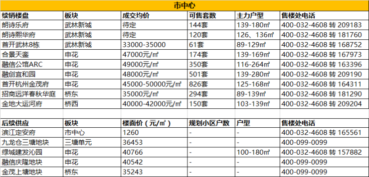
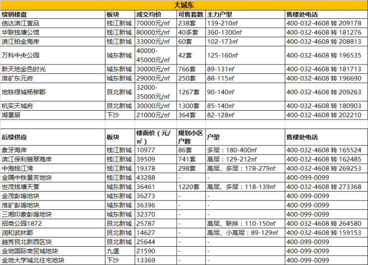
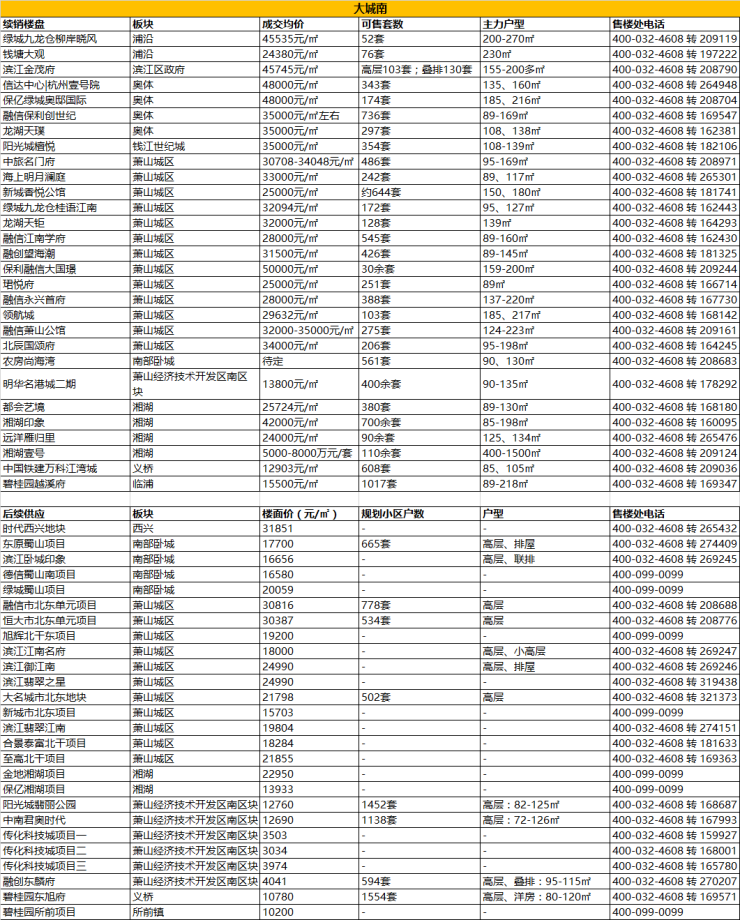
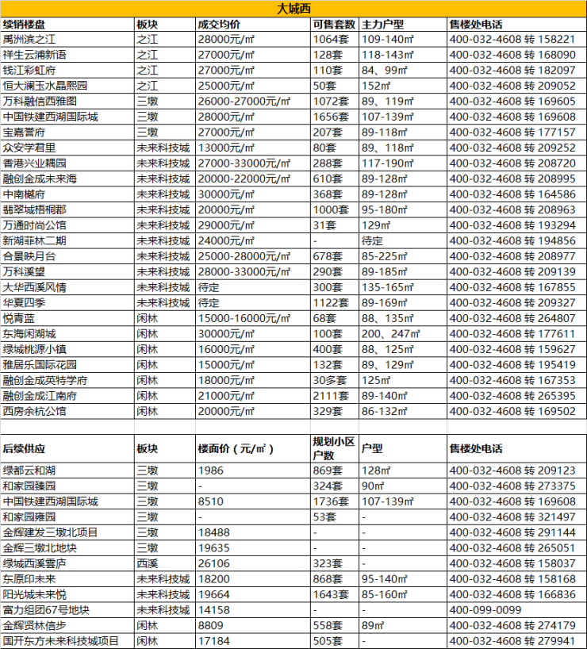
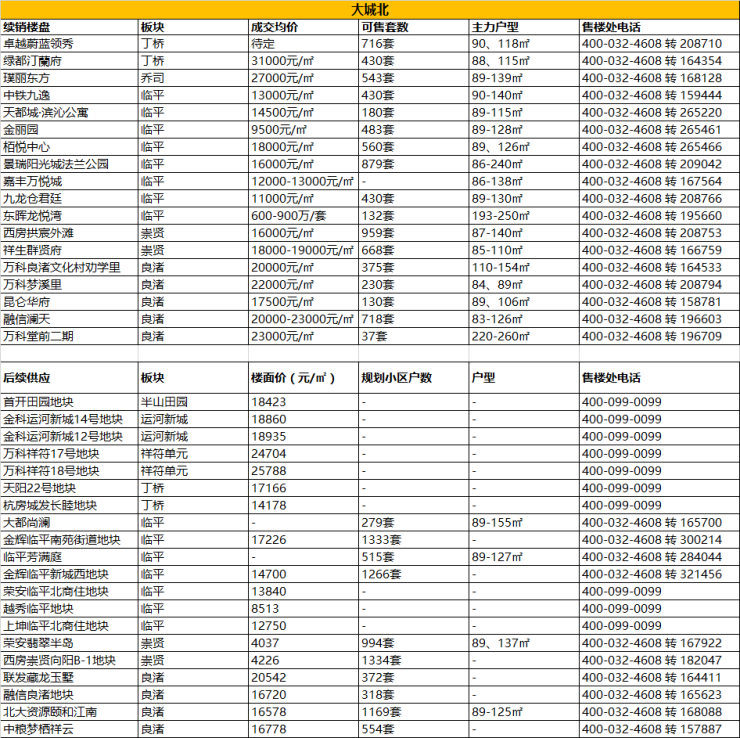
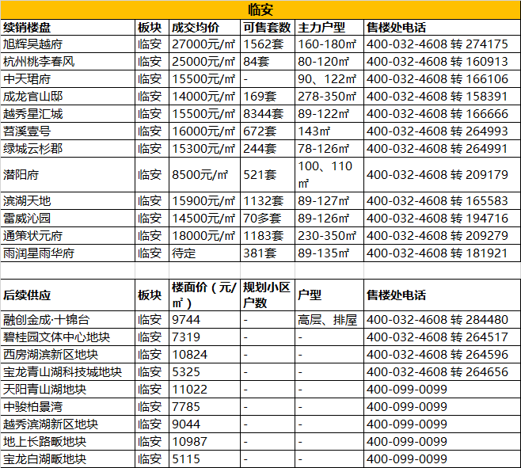
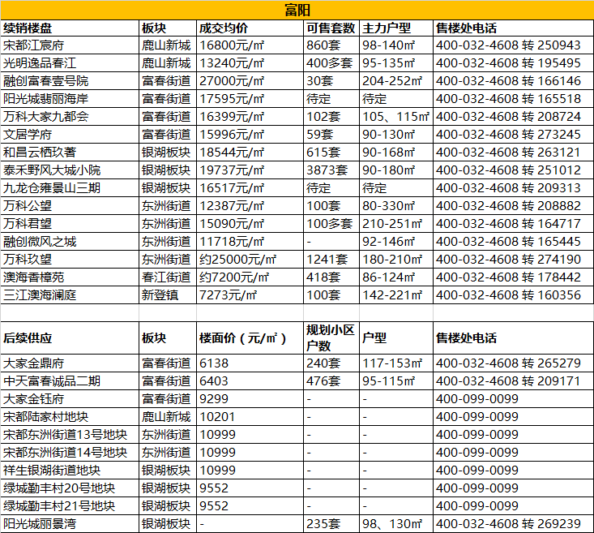
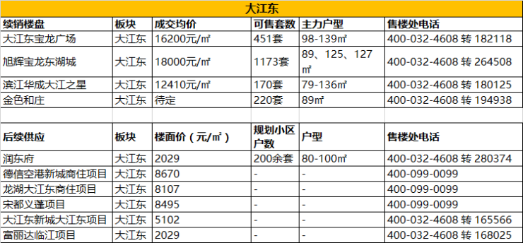

## 二：<a name="关于房子要知道的一些概念">关于房子要知道的一些概念</a>

一些房产的基本名词有助于看懂规划图

### 1.<a name="用地性质">[用地性质](https://baike.baidu.com/item/%E7%94%A8%E5%9C%B0%E6%80%A7%E8%B4%A8/7418473) </a>

    用地性质对照表

    

                            
                

                            
<table class="confluenceTable"><tbody><tr><th colspan="3" class="confluenceTh">
类别代称
</th><th rowspan="2" class="confluenceTh">
类别名称
</th><th rowspan="2" class="confluenceTh">
内容
</th></tr><tr><th class="confluenceTh">
大类
</th><th class="confluenceTh">
中类
</th><th class="confluenceTh">
小类
</th></tr><tr><td rowspan="10" class="confluenceTd">
R

居住用地
</td><td class="confluenceTd"> </td><td class="confluenceTd"> </td><td class="confluenceTd">
居住用地
</td><td class="confluenceTd">
住宅和相应服务设施的用地
</td></tr><tr><td rowspan="3" class="confluenceTd">
R1
</td><td class="confluenceTd"> </td><td class="confluenceTd">
一类居住用地
</td><td class="confluenceTd">
设施齐全、环境良好，以低层住宅为主的用地
</td></tr><tr><td class="confluenceTd">
R11
</td><td class="confluenceTd">
住宅用地
</td><td class="confluenceTd">
住宅建筑用地及其附属道路、停车场、小游园等用地
</td></tr><tr><td class="confluenceTd">
R12
</td><td class="confluenceTd">
服务设施用地
</td><td class="confluenceTd">
居住小区及小区级以下的幼托、文化、体育、商业、卫生服务、养老助残设施等用地，不包括中小学用地
</td></tr><tr><td rowspan="3" class="confluenceTd">
R2
</td><td class="confluenceTd"> </td><td class="confluenceTd">
二类居住用地
</td><td class="confluenceTd">
设施较齐全、环境较好，以多、中、高层住宅为主用地
</td></tr><tr><td class="confluenceTd">
R21
</td><td class="confluenceTd">
住宅用地
</td><td class="confluenceTd">
住宅建筑用地（含保障性住宅用地）及其附属道路、停车场、小游园等用地
</td></tr><tr><td class="confluenceTd">
R22
</td><td class="confluenceTd">
服务设施用地
</td><td class="confluenceTd">
居住小区及小区级以下的幼托、文化、体育、商业、卫生服务、养老助残设施等用地，不包括中小学用地
</td></tr><tr><td rowspan="3" class="confluenceTd">
R3
</td><td class="confluenceTd"> </td><td class="confluenceTd">
三类居住用地
</td><td class="confluenceTd">
设施较欠缺、环境较差，以需要加以改造的简陋住区用地，包括危房、棚户区、临时住宅等用地
</td></tr><tr><td class="confluenceTd">
R31
</td><td class="confluenceTd">
住宅用地
</td><td class="confluenceTd">
住宅建筑用地及其附属道路、停车场及小游园等用地
</td></tr><tr><td class="confluenceTd">
R32
</td><td class="confluenceTd">
服务设施用地
</td><td class="confluenceTd">
居住小区及小区级以下的幼托、文化、体育、商业、卫生服务、养老助残设施等用地，不包括中小学用地
</td></tr><tr><td rowspan="23" class="confluenceTd">
A

公共管理与公共服务设施用地
</td><td class="confluenceTd"> </td><td class="confluenceTd"> </td><td class="confluenceTd">
公共管理与公共服务用地
</td><td class="confluenceTd">
行政、文化、教育、体育、卫生等机构和设施的用地，不包括居住用地中的服务设施用地
</td></tr><tr><td class="confluenceTd">
A1
</td><td class="confluenceTd"> </td><td class="confluenceTd">
行政办公用地
</td><td class="confluenceTd">
党政机关、社会团体、事业单位等办公机构及其相关设施用地
</td></tr><tr><td rowspan="3" class="confluenceTd">
A2
</td><td class="confluenceTd"> </td><td class="confluenceTd">
文化设施用地
</td><td class="confluenceTd">
图书、展览等公共文化活动设施用地
</td></tr><tr><td class="confluenceTd">
A21
</td><td class="confluenceTd">
图书展览设施用地
</td><td class="confluenceTd">
公共图书馆、博物馆、档案馆、科技馆、纪念馆、美术馆和展览馆、会展中心等设施用地
</td></tr><tr><td class="confluenceTd">
A22
</td><td class="confluenceTd">
文化活动设施用地
</td><td class="confluenceTd">
综合文化活动中心、文化馆、青少年宫、儿童活动中心、老年活动中心等设施用地
</td></tr><tr><td rowspan="6" class="confluenceTd">
A3
</td><td class="confluenceTd"> </td><td class="confluenceTd">
教育科研用地
</td><td class="confluenceTd">
高等院校、中等专业学校、中学、小学、科研事业单位及其附属设施用地，包括为学校配建的独立地段的学生生活用地
</td></tr><tr><td class="confluenceTd">
A31
</td><td class="confluenceTd">
高等院校用地
</td><td class="confluenceTd">
大学、学院、专科学校、研究生院、电视大学、党校、干部学校及其附属设施用地，包括军事院校用地
</td></tr><tr><td class="confluenceTd">
A32
</td><td class="confluenceTd">
中等专业学校用地
</td><td class="confluenceTd">
中等专业学校、技工学校、职业学校等用地，不包括附属于普通中学内的职业高中用地
</td></tr><tr><td class="confluenceTd">
A33
</td><td class="confluenceTd">
中小学用地
</td><td class="confluenceTd">
中学、小学用地
</td></tr><tr><td class="confluenceTd">
A34
</td><td class="confluenceTd">
特殊教育用地
</td><td class="confluenceTd">
聋、哑、盲人学校及工读学校等用地
</td></tr><tr><td class="confluenceTd">
A35
</td><td class="confluenceTd">
科研用地
</td><td class="confluenceTd">
科研事业单位用地
</td></tr><tr><td rowspan="3" class="confluenceTd">
A4
</td><td class="confluenceTd"> </td><td class="confluenceTd">
体育用地
</td><td class="confluenceTd">
体育场馆和体育训练基地等用地，不包括学校等机构专用的体育设施用地
</td></tr><tr><td class="confluenceTd">
A41
</td><td class="confluenceTd">
体育场馆用地
</td><td class="confluenceTd">
室内外体育运动用地，包括体育场馆、游泳场馆、各类球场及其附属的业余体校等用地
</td></tr><tr><td class="confluenceTd">
A42
</td><td class="confluenceTd">
体育训练用地
</td><td class="confluenceTd">
为各类体育运动专设的训练基地用地
</td></tr><tr><td rowspan="5" class="confluenceTd">
A5
</td><td class="confluenceTd"> </td><td class="confluenceTd">
医疗卫生用地
</td><td class="confluenceTd">
医疗、保健、卫生、防疫、康复和急救设施等用地
</td></tr><tr><td class="confluenceTd">
A51
</td><td class="confluenceTd">
医院用地
</td><td class="confluenceTd">
综合医院、专科医院、社区卫生服务中心等用地
</td></tr><tr><td class="confluenceTd">
A52
</td><td class="confluenceTd">
卫生防疫用地
</td><td class="confluenceTd">
卫生防疫站、专科防治所、检验中心和动物检疫站等用地
</td></tr><tr><td class="confluenceTd">
A53
</td><td class="confluenceTd">
特殊医疗用地
</td><td class="confluenceTd">
对环境有特殊要求的传染病、精神病等专科医院用地
</td></tr><tr><td class="confluenceTd">
A59
</td><td class="confluenceTd">
其他医疗卫生用地
</td><td class="confluenceTd">
急救中心、血库等用地
</td></tr><tr><td class="confluenceTd">
A6
</td><td class="confluenceTd"> </td><td class="confluenceTd">
社会福利设施用地
</td><td class="confluenceTd">
为社会提供福利和慈善服务的设施及其附属设施用地，包括福利院、养老院、孤儿院等用地
</td></tr><tr><td class="confluenceTd">
A7
</td><td class="confluenceTd"> </td><td class="confluenceTd">
文物古迹用地
</td><td class="confluenceTd">
具有保护价值的古遗迹、古墓葬、古建筑、古窟寺、近代代表性建筑、革命纪念建筑等用地。不包括已作其他用途的文物古迹用地
</td></tr><tr><td class="confluenceTd">
A8
</td><td class="confluenceTd"> </td><td class="confluenceTd">
外事用地
</td><td class="confluenceTd">
外国驻华使馆、领事馆、国际机构及其生活设施等用地
</td></tr><tr><td class="confluenceTd">
A9
</td><td class="confluenceTd"> </td><td class="confluenceTd">
宗教设施用地
</td><td class="confluenceTd">
宗教活动场所用地
</td></tr><tr><td rowspan="17" class="confluenceTd">
B

商业服务业设施用地
</td><td class="confluenceTd"> </td><td class="confluenceTd"> </td><td class="confluenceTd">
商业服务业设施用地
</td><td class="confluenceTd">
商业、商务、娱乐康体等设施用地，不包括居住用地中的服务设施用地
</td></tr><tr><td rowspan="5" class="confluenceTd">
B1
</td><td class="confluenceTd"> </td><td class="confluenceTd">
商业设施用地
</td><td class="confluenceTd">
商业及餐饮、旅馆等服务业用地
</td></tr><tr><td class="confluenceTd">
B11
</td><td class="confluenceTd">
零售商业用地
</td><td class="confluenceTd">
以零售功能为主的商铺、商场、超市、市场等用地
</td></tr><tr><td class="confluenceTd">
B12
</td><td class="confluenceTd">
批发市场用地
</td><td class="confluenceTd">
以批发为主的市场用地
</td></tr><tr><td class="confluenceTd">
B13
</td><td class="confluenceTd">
餐饮用地
</td><td class="confluenceTd">
饭店、餐厅、酒吧等用地
</td></tr><tr><td class="confluenceTd">
B14
</td><td class="confluenceTd">
旅馆用地
</td><td class="confluenceTd">
宾馆、旅馆、招待所、服务型公寓、度假村等用地
</td></tr><tr><td rowspan="4" class="confluenceTd">
B2
</td><td class="confluenceTd"> </td><td class="confluenceTd">
商务设施用地
</td><td class="confluenceTd">
金融保险、艺术传媒、技术服务等综合性办公用地
</td></tr><tr><td class="confluenceTd">
B21
</td><td class="confluenceTd">
金融保险用地
</td><td class="confluenceTd">
银行、证券期货交易所、保险公司等用地
</td></tr><tr><td class="confluenceTd">
B22
</td><td class="confluenceTd">
艺术传媒用地
</td><td class="confluenceTd">
文艺团体、影视制作、广告传媒等用地
</td></tr><tr><td class="confluenceTd">
B29
</td><td class="confluenceTd">
其他商务设施用地
</td><td class="confluenceTd">
贸易、设计、咨询等技术服务办公用地
</td></tr><tr><td rowspan="3" class="confluenceTd">
B3
</td><td class="confluenceTd"> </td><td class="confluenceTd">
娱乐康体设施用地
</td><td class="confluenceTd">
娱乐、康体等设施用地
</td></tr><tr><td class="confluenceTd">
B31
</td><td class="confluenceTd">
娱乐用地
</td><td class="confluenceTd">
剧院、音乐厅、电影院、歌舞厅、网吧以及绿地率小于65%的大型游乐等设施用地
</td></tr><tr><td class="confluenceTd">
B32
</td><td class="confluenceTd">
康体用地
</td><td class="confluenceTd">
赛马场、高尔夫、溜冰场、跳伞场、摩托车场、射击场，以及通用航空、水上运动的陆域部分等用地
</td></tr><tr><td rowspan="3" class="confluenceTd">
B4
</td><td class="confluenceTd"> </td><td class="confluenceTd">
公用设施营业网点用地
</td><td class="confluenceTd">
零售加油、加气、电信、邮政等公用设施营业网点用地
</td></tr><tr><td class="confluenceTd">
B41
</td><td class="confluenceTd">
加油加气站用地
</td><td class="confluenceTd">
零售加油、加气以及液化石油气换瓶站用地
</td></tr><tr><td class="confluenceTd">
B49
</td><td class="confluenceTd">
其他公用设施营业网点用地
</td><td class="confluenceTd">
独立地段的电信、邮政、供水、燃气、供电、供热等其他公用设施营业网点用地
</td></tr><tr><td class="confluenceTd">
B9
</td><td class="confluenceTd"> </td><td class="confluenceTd">
其他服务设施用地
</td><td class="confluenceTd">
业余学校、民营培训机构、私人诊所、殡葬、宠物医院、汽车维修站等其他服务设施用地
</td></tr><tr><td rowspan="4" class="confluenceTd">
M

工业用地
</td><td class="confluenceTd"> </td><td class="confluenceTd"> </td><td class="confluenceTd">
工业用地
</td><td class="confluenceTd">
工矿企业的生产车间、库房及其附属设施等用地，包括专用铁路、码头和辅助道路、停车场等用地，不包括露天矿用地
</td></tr><tr><td class="confluenceTd">
M1
</td><td class="confluenceTd"> </td><td class="confluenceTd">
一类工业用地
</td><td class="confluenceTd">
对居住和公共环境基本无干扰、污染和安全隐患的工业用地
</td></tr><tr><td class="confluenceTd">
M2
</td><td class="confluenceTd"> </td><td class="confluenceTd">
二类工业用地
</td><td class="confluenceTd">
对居住和公共环境有一定干扰、污染和安全隐患的工业用地
</td></tr><tr><td class="confluenceTd">
M3
</td><td class="confluenceTd"> </td><td class="confluenceTd">
三类工业用地
</td><td class="confluenceTd">
对居住和公共环境有严重干扰、污染和安全隐患的工业用地
</td></tr><tr><td rowspan="4" class="confluenceTd">
W

物流仓储用地
</td><td class="confluenceTd"> </td><td class="confluenceTd"> </td><td class="confluenceTd">
物流仓储用地
</td><td class="confluenceTd">
物资储备、中转、配送等用地，包括附属道路、停车场以及货运公司车队的站场等用地
</td></tr><tr><td class="confluenceTd">
W1
</td><td class="confluenceTd"> </td><td class="confluenceTd">
一类物流仓储用地
</td><td class="confluenceTd">
对居住和公共环境基本无干扰、污染和安全隐患的物流仓储用地
</td></tr><tr><td class="confluenceTd">
W2
</td><td class="confluenceTd"> </td><td class="confluenceTd">
二类物流仓储用地
</td><td class="confluenceTd">
对居住和公共环境有一定干扰、污染和安全隐患的物流仓储用地
</td></tr><tr><td class="confluenceTd">
W3
</td><td class="confluenceTd"> </td><td class="confluenceTd">
三类物流仓储用地
</td><td class="confluenceTd">
存放易燃、易爆和剧毒等危险品的专用仓库用地
</td></tr><tr><td rowspan="8" class="confluenceTd">
S

道路与交通设施用地
</td><td class="confluenceTd"> </td><td class="confluenceTd"> </td><td class="confluenceTd">
道路与交通设施用地
</td><td class="confluenceTd">
城市道路、交通设施等用地，不包括居住用地、工业用地等内部的道路、停车场等用地
</td></tr><tr><td class="confluenceTd">
S1
</td><td class="confluenceTd"> </td><td class="confluenceTd">
城市道路用地
</td><td class="confluenceTd">
快速路、主干路、次干路和支路等用地，包括其交叉路口用地
</td></tr><tr><td class="confluenceTd">
S2
</td><td class="confluenceTd"> </td><td class="confluenceTd">
城市轨道交通用地
</td><td class="confluenceTd">
独立地段的城市轨道交通地面以上部分的线路、站点用地
</td></tr><tr><td class="confluenceTd">
S3
</td><td class="confluenceTd"> </td><td class="confluenceTd">
交通枢纽用地
</td><td class="confluenceTd">
铁路客货运站、公路长途客货运站、港口客运码头、公交枢纽及其附属设施用地
</td></tr><tr><td rowspan="3" class="confluenceTd">
S4
</td><td class="confluenceTd"> </td><td class="confluenceTd">
交通场站用地
</td><td class="confluenceTd">
交通服务设施用地，不包括交通指挥中心、交通队用地
</td></tr><tr><td class="confluenceTd">
S41
</td><td class="confluenceTd">
公共交通设施用地
</td><td class="confluenceTd">
城市轨道交通车辆基地及附属设施，公共汽（电）车首末站、停车场（库）、保养场，出租汽车场站设施等用地，以及轮渡、缆车、索道等的地面部分及其附属设施用地
</td></tr><tr><td class="confluenceTd">
S42
</td><td class="confluenceTd">
社会停车场用地
</td><td class="confluenceTd">
独立地段的公共停车场和停车库用地，不包括其他各类用地配建的停车场和停车库用地
</td></tr><tr><td class="confluenceTd">
S9
</td><td class="confluenceTd"> </td><td class="confluenceTd">
其它交通设施用地
</td><td class="confluenceTd">
除以上之外的交通设施用地，包括教练场等用地
</td></tr><tr><td rowspan="16" class="confluenceTd">
U

公用设施用地
</td><td class="confluenceTd"> </td><td class="confluenceTd"> </td><td class="confluenceTd">
公用设施用地
</td><td class="confluenceTd">
供应、环境、安全等设施用地
</td></tr><tr><td rowspan="7" class="confluenceTd">
U1
</td><td class="confluenceTd"> </td><td class="confluenceTd">
供应设施用地
</td><td class="confluenceTd">
供水、供电、供燃气和供热等设施用地
</td></tr><tr><td class="confluenceTd">
U11
</td><td class="confluenceTd">
供水用地
</td><td class="confluenceTd">
城市取水设施、自来水厂、再生水厂、加压泵站、高位水池等设施用地
</td></tr><tr><td class="confluenceTd">
U12
</td><td class="confluenceTd">
供电用地
</td><td class="confluenceTd">
变电站、开闭所、变配电所等设施用地，不包括电厂用地、高压走廊下规定的控制范围内的用地应按其地面实际用途归类
</td></tr><tr><td class="confluenceTd">
U13
</td><td class="confluenceTd">
供燃气用地
</td><td class="confluenceTd">
分输站、门站、储气站、加气母站、液化石油气储配站、灌瓶站和地面输气管廊等设施用地，不包括制气场用地
</td></tr><tr><td class="confluenceTd">
U14
</td><td class="confluenceTd">
供热用地
</td><td class="confluenceTd">
集中供热锅炉房、热力站、换热站和地面输热管廊等设施用地
</td></tr><tr><td class="confluenceTd">
U15
</td><td class="confluenceTd">
邮政设施用地
</td><td class="confluenceTd">
邮政中心局、邮政支局、邮件处理中心、电信局、移动基站、微波站等设施用地
</td></tr><tr><td class="confluenceTd">
U16
</td><td class="confluenceTd">
广播电视设施用地
</td><td class="confluenceTd">
广播电视的发射、传输和监测设施用地，包括无线电收信区、发信区以及广播电视发射台、转播台、差转台、监测站等设施用地
</td></tr><tr><td rowspan="4" class="confluenceTd">
U2
</td><td class="confluenceTd"> </td><td class="confluenceTd">
环境设施用地
</td><td class="confluenceTd">
雨水、污水、固体废物处理和环境保护等的公用设施及其附属设施用地
</td></tr><tr><td class="confluenceTd">
U21
</td><td class="confluenceTd">
排水设施用地
</td><td class="confluenceTd">
雨水泵站、污水泵站、污水处理、污泥处理厂等及其附属的构筑物用地，不包括排水河渠用地
</td></tr><tr><td class="confluenceTd">
U22
</td><td class="confluenceTd">
环卫设施用地
</td><td class="confluenceTd">
垃圾转运站、公厕、车辆清洗站、环卫车辆停放修理厂等用地
</td></tr><tr><td class="confluenceTd">
U23
</td><td class="confluenceTd">
环保设施用地
</td><td class="confluenceTd">
垃圾处理、危险品处理、医疗垃圾处理等设施用地
</td></tr><tr><td rowspan="3" class="confluenceTd">
U3
</td><td class="confluenceTd"> </td><td class="confluenceTd">
安全设施用地
</td><td class="confluenceTd">
消防、防洪等保卫城市安全的公用设施及其附属设施用地
</td></tr><tr><td class="confluenceTd">
U31
</td><td class="confluenceTd">
消防设施用地
</td><td class="confluenceTd">
消防站、消防通信及指挥训练中心等设施用地
</td></tr><tr><td class="confluenceTd">
U32
</td><td class="confluenceTd">
防洪设施用地
</td><td class="confluenceTd">
防洪堤、防洪枢纽、排洪沟渠等设施用地
</td></tr><tr><td class="confluenceTd">
U9
</td><td class="confluenceTd"> </td><td class="confluenceTd">
其他公用设施用地
</td><td class="confluenceTd">
除以上之外的公用设施用地，包括施工、养护、维修设施等用地
</td></tr><tr><td rowspan="4" class="confluenceTd">
G

绿地与广场用地
</td><td class="confluenceTd"> </td><td class="confluenceTd"> </td><td class="confluenceTd">
绿地与广场用地
</td><td class="confluenceTd">
公园绿地、防护绿地、广场等公共开放空间用地
</td></tr><tr><td class="confluenceTd">
G1
</td><td class="confluenceTd"> </td><td class="confluenceTd">
公园绿地
</td><td class="confluenceTd">
向公众开放，以游憩为主要功能，兼具生态、美化、防灾等作用的绿地
</td></tr><tr><td class="confluenceTd">
G2
</td><td class="confluenceTd"> </td><td class="confluenceTd">
防护绿地
</td><td class="confluenceTd">
具有卫生、隔离和安全防护功能的绿地
</td></tr><tr><td class="confluenceTd">
G3
</td><td class="confluenceTd"> </td><td class="confluenceTd">
广场用地
</td><td class="confluenceTd">
以游憩、纪念、集会和避险等功能为主的城市公共活动场地
</td></tr></tbody></table>

                    

    

城市建设用地分类中英文对照表

<table class="confluenceTable"><tbody><tr><td class="confluenceTd">
代码

codes
</td><td class="confluenceTd">
用地类别中文名称

Chinese
</td><td class="confluenceTd">
英文同（近）义词

English
</td></tr><tr><td class="confluenceTd">
R
</td><td class="confluenceTd">
居住用地
</td><td class="confluenceTd">
residential
</td></tr><tr><td class="confluenceTd">
A
</td><td class="confluenceTd">
公共管理与公共服务用地
</td><td class="confluenceTd">
administration and public services
</td></tr><tr><td class="confluenceTd">
B
</td><td class="confluenceTd">
商业服务业设施用地
</td><td class="confluenceTd">
commercial and business facilities
</td></tr><tr><td class="confluenceTd">
M
</td><td class="confluenceTd">
工业用地
</td><td class="confluenceTd">
industrial
</td></tr><tr><td class="confluenceTd">
W
</td><td class="confluenceTd">
物流仓储用地
</td><td class="confluenceTd">
logistics and warehouse
</td></tr><tr><td class="confluenceTd">
S
</td><td class="confluenceTd">
道路与交通设施用地
</td><td class="confluenceTd">
road,street and transportation
</td></tr><tr><td class="confluenceTd">
U
</td><td class="confluenceTd">
公用设施用地
</td><td class="confluenceTd">
municipal utilities
</td></tr><tr><td class="confluenceTd">
G
</td><td class="confluenceTd">
绿地与广场用地
</td><td class="confluenceTd">
green space and square
</td></tr></tbody></table>

### 2.<a name="容积率">[容积率](https://baike.baidu.com/item/%E5%AE%B9%E7%A7%AF%E7%8E%87/1397682?fr=aladdin)</a>

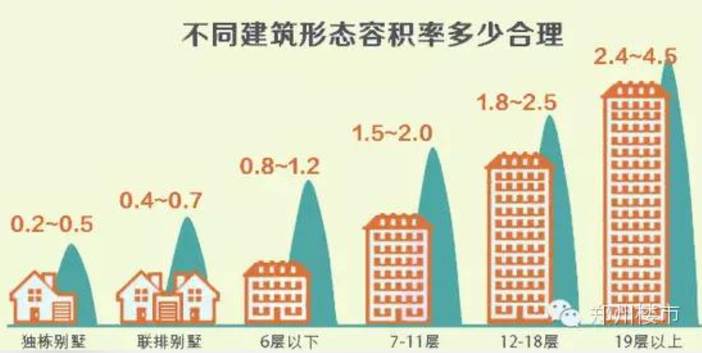

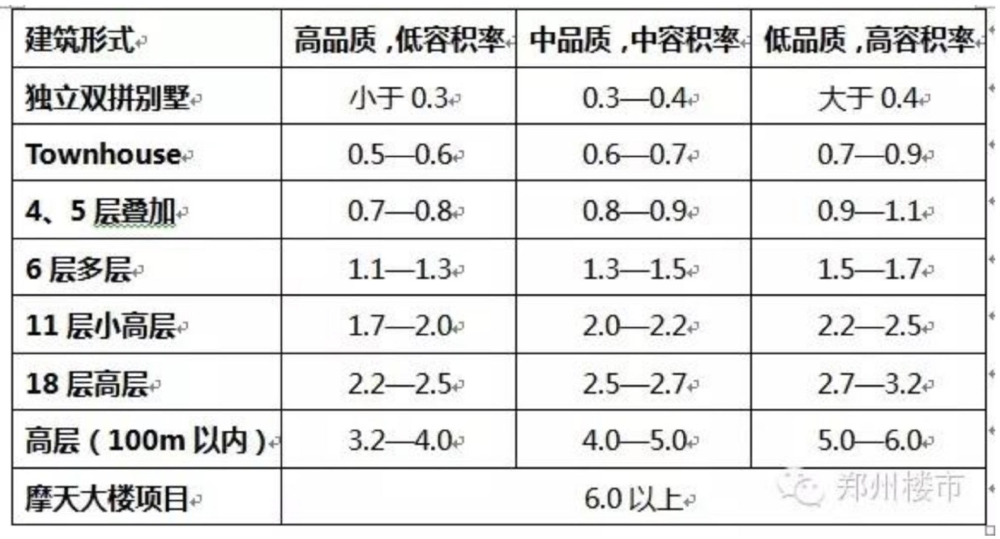

### 3.<a name="买房时定金订金诚意金认筹金区别">[买房时定金 订金 诚意金 认筹金 区别](http://zhishi.fang.com/xf/yt_132181.html)</a>

<table class="confluenceTable"><tbody><tr><th class="confluenceTh">分类</th><th class="confluenceTh">定义</th><th class="confluenceTh">是否可以无条件退款</th></tr><tr><td class="confluenceTd">定金</td><td class="confluenceTd">

定金是在合同订立或在履行之前支付的一定数额的金钱作为担保的担保方式，又称保证金

《担保法》第八十九条当事人可以约定一方向对方给付定金作为债权的担保。

债务人履行债务后，定金应当抵作价款或者收回。给付定金的一方不履行约定的债务的，

无权要求返还定金;收受定金的一方不履行约定的债务的，应当双倍返还定金。
</td><td class="confluenceTd">无权要求返还定金</td></tr><tr><td class="confluenceTd">订金</td><td class="confluenceTd">

在购房者与发展商就房屋买卖的意向初步达成协议后，准备进一步协商签订的临时认购协议，

通常的做法是在约定所选房号、面积、房屋单价及总价款后，约定一个期限，买方需在此期限

内与卖方签署正式合同。买方支付订金即取得了在此期限内的优先购买权。一般情况下，视作预付款。

预付款不具有担保债的履行的作用，也不能证明合同的成立。预付款在合同正常履行的情况下,成为价

款的一部分,在合同没有得到履行的情况下,不管是给付一方当事人违约,还是接受方违约,预付款都要原数返回。
</td><td class="confluenceTd">无条件退款</td></tr><tr><td class="confluenceTd">认筹金</td><td class="confluenceTd">

“认筹”就是购房者表现出买房的诚意，这个诚意需要通过缴纳“认筹金”来体现。在缴纳“认筹金”后，

购房者可以获得房屋的优先购买权，并在房价上享受一定程度的优惠。等到楼盘正式开盘销售时，

“认筹”的购房者再以“优先选择”的顺序选房，选中房屋后与开发商签订正式的房屋买卖合同。

如果购房者没有选中理想的房屋，开发商将把“认筹金”如数退还给购房者。但是“认筹金”的实质

作用是开发商在开盘前得到的大笔资金并在短时期内收回大笔资金，解决开发商的燃眉之急。
</td><td class="confluenceTd">无条件退款</td></tr><tr><td colspan="1" class="confluenceTd">诚意金</td><td colspan="1" class="confluenceTd">

即意向金，这在中介与买房和卖房双方签定的合同中多有体现，其实法律上并没有诚意金之说，

中介与买卖双方之所以签定什么诚意金条款，主要是由于我们交易市场的诚实信用体系还不健全，

交易主体为了各自的利益往往会违背诚实信用的原则，从而损害一方的利益。
</td><td colspan="1" class="confluenceTd">无条件退款</td></tr></tbody></table>

综上所述，后三者都是可以无条件退款的，即使是这样，签订任何条款是也要看清楚，要留心眼。例如在房产中介门店看房时，如果需要付意向金的话，只要收下房产中介开具的收据即可。对于房产中介人员提出的签订协议的要求，一定要慎重，如果房屋买卖双方仅仅是想建立一个定房关系的话，在签约时，可以要求中介公司将“居间协议”附件“房屋买卖协议”划掉，以保护自己的权益。

### 4. <a name="绿化率多少合适住宅小区绿化率标准">[绿化率多少合适 住宅小区绿化率标准](http://hf.haoju.cn/news/2095580)</a>

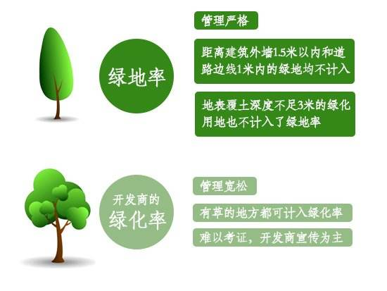

### 5.<a name="楼层净高">[楼层净高](https://baike.baidu.com/item/%E6%A5%BC%E5%B1%82%E5%87%80%E9%AB%98/10657207?fr=aladdin)</a>

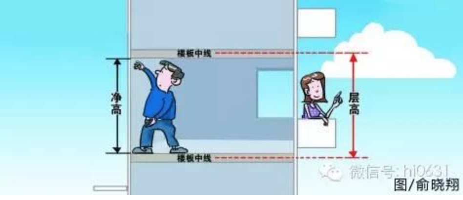

### 6.<a name="为什么每层住宅楼层默认高是在3米左右？">[为什么每层住宅楼层默认高是在 3 米左右？](https://www.zhihu.com/question/19768121)</a>

### 7.<a name="杭州2017年的现房销售政策">杭州2017年的现房销售政策</a>

[现房销售时代，真的来临了吗](http://zzhz.zjol.com.cn/system/2017/05/04/021506056.shtml)

[杭州土地出让取消现房销售规则](http://zj.zjol.com.cn/news/696408.html)

### 8.<a name="3分钟！搞定杭州人才居住证！">[3分钟！搞定杭州人才居住证！](https://mp.weixin.qq.com/s/2zbRdzXfYc78Wt3si5EIUw) </a>

### 9.<a name="买房选择东边套西边套还是中间套？">买房选择东边套 西边套 还是中间套？</a>

边套：边套是指有一面墙完全承受日晒的套房，其中在东边的称东边套，西边的西边套。西套因为承受下午日晒，俗话说西晒，居室内相对较热。

中间套：中间套是2个边套（东边套、西边套）中间的房子，一般客厅、餐厅、阳台连为一体，阳台较大、视野较为开阔。

<table class="confluenceTable"><tbody><tr><th class="confluenceTh"> </th><th class="confluenceTh">优点</th><th class="confluenceTh">缺点</th><th class="confluenceTh">选择意见</th></tr><tr><td class="confluenceTd">东边套</td><td class="confluenceTd">

1、三面采光，窗明几净，阳光充足；

2、早晨可以被第一缕阳光照醒；

3、夏季东南风为主，通风好，凉快 

 不存在西晒。
</td><td class="confluenceTd">

1、客厅阳光照射时间短，冬天比较阴冷；

2、在南方的话，受雨季和风向的影响，

东边套的房子，下雨天更容易进水；

而且更为潮湿。
</td><td class="confluenceTd">

注意看房屋的防潮防水措施是否妥当，避免出现漏水，也略微减轻室内的潮湿程度。

 东边套和西边套来比较，东边套的采光和通风性往往更好，这也是人们选择户型时

比较看重的，而且夏天不会有西晒问题，室内较西边套更为凉爽，如果你比较怕热，

而且喜欢早上的第一缕阳光，那你最好选择东边套。
</td></tr><tr><td class="confluenceTd">西边套</td><td class="confluenceTd">

1、下午阳光充足，下班到家还能享受到

较后一缕阳光；

2、渗水的可能性比较小；

3、冬天比较温暖，省了暖气钱；

4、比东边套价格便宜。
</td><td class="confluenceTd">

1、夏天西晒就很严重，会很热；

2、冬天西边套的阳台晒太阳的时间也有限，

可能不够温暖，西北风劲头也很足。
</td><td class="confluenceTd">

注意看西边有无遮挡，房屋的保温设施做得如何，能在一定程度上能减轻西晒的影响。

西边套的最大问题是西晒，夏天会比较热，如果在北方，冬天的时候因为风向的问题

也往往比东边套更冷，但与东边套相比，西边套在多雨水季节发生渗水的可能性更小。

如果你想在冬天的时候能够多晒晒太阳，而且不是特别怕热，认为在夏天的时候一个

空调可以解决西晒问题，那么西边套也不失为一个好选择。最重要的是，西边套的价

格往往比东边套更便宜。
</td></tr><tr><td class="confluenceTd">中间套</td><td class="confluenceTd">

1、有一些三面朝南的套二户型，

采光非常好；

2、客厅朝南，下午不会没阳光，

也不存在西晒。

3、价格上来说，单价比边套便宜。
</td><td class="confluenceTd">

1、由于位于中间，只有南北两面采光，

容易出现暗间；

2、通风性稍逊东边套和西边套。

3、中间的房子可能听到隔壁邻居传来的声音。
</td><td class="confluenceTd">注意选择南北通透的户型。</td></tr></tbody></table>

### 10.<a name="公摊面积">公摊面积</a>

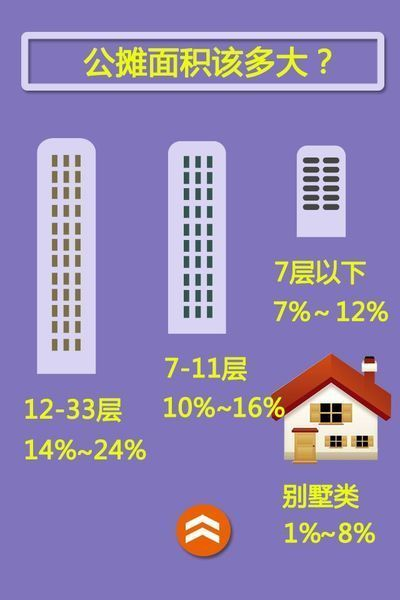

**公摊面积的计算方法：**

1．房子分摊的公用建筑面积＝房子公用建筑面积分摊系数×套内建筑面积。公用建筑面积分摊系数＝公用建筑面积／房子套内建筑面积之和。

2．公用建筑面积＝整栋房子建筑物的建筑面积－整栋建筑物各套（单元）套内房子建筑面积之和－已作为独立使用的空间销售或者用来出租的地下室、

车棚及人防工程等建筑面积。套内建筑面积＝套内使用面积＋套内墙体面积＋阳台建筑面积。
### 11.<a name="房子如何买及首付要求">房子如何买及首付要求</a>

[吐血整理！2017年杭州买房条件 一张图让你读懂](http://esf.hz.fang.com/newsecond/news/25526268.htm) 

### 12.<a name="二手房购买攻略">二手房购买攻略</a>
https://zhuanlan.zhihu.com/p/33623170 杭州二手房看房、询价、谈判、过户技巧

## 三：<a name="杭州开发商信息与对比">杭州开发商信息与对比</a>(还没写)

## 四：<a name="杭州房产信息渠道">杭州房产信息渠道</a>

### 1.<a name="透明售房网">透明售房网</a>

[http://www.tmsf.com/](http://www.tmsf.com/)

最专业、最权威，具有独家成交数据的房地产网.网签信息。拍地信息都很及时准确。

找新房不需要中介直接看上面的电话拨打即可。

[http://www.tmsf.com/index.jsp](http://www.tmsf.com/index.jsp)  资讯

[http://www.tmsf.com/newhouse/property\_330184\_205726779\_control.htm](http://www.tmsf.com/newhouse/property_330184_205726779_control.htm)  理解销控表

[http://map.tmsf.com/map.html?locationtype=city&amp;locationid=33](http://map.tmsf.com/map.html?locationtype=city&amp;locationid=33) 地图找房

[http://www.tmsf.com/zt/landspecial/](http://www.tmsf.com/zt/landspecial/)  土拍

### 2.口水楼市

[http://zzhzbbs.zjol.com.cn/forum-2-1.html](http://zzhzbbs.zjol.com.cn/forum-2-1.html)

里面多数是狭隘的杭州区域喷子。多关注房产动向和规划信息。

### 3.19楼房产

[http://house.19lou.com/](http://house.19lou.com/)

老牌有用的不多了。

### 4.公众号

1) 杭州住宅销售数据 ---- 每天的销售数据(重点关注)

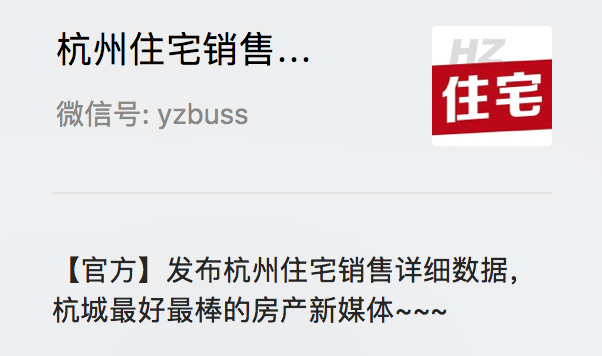

2) 钱报杭州房产 ---- 房产信息导购资讯(重点关注)

3) 拿地宝 ---- 土拍信息，土地规划(重点关注)

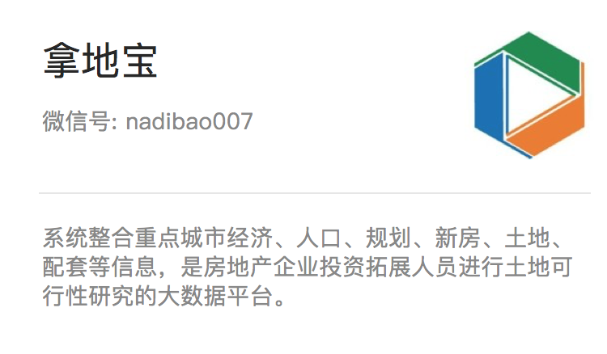

4) 杭州发布 —  权威的信息发布(重点关注)

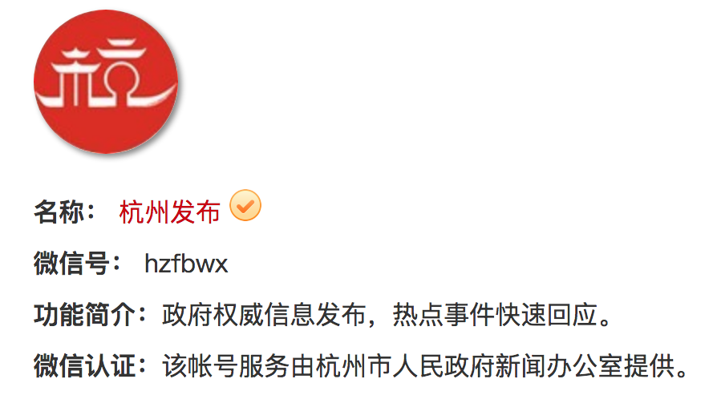

5) 透明售房网 —  微信端的透明售房网咨询整合(重点关注)

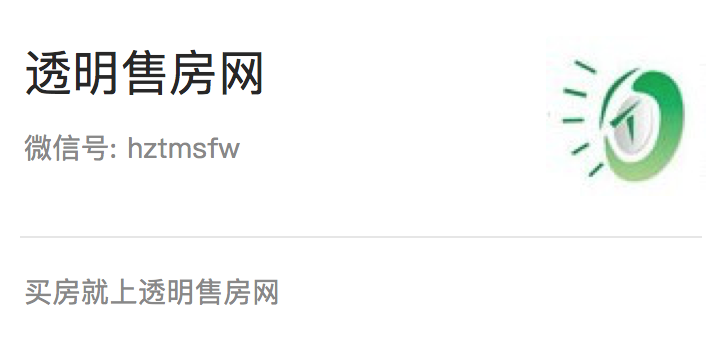

6) 杭州口水楼市 —  网友论坛每天的咨询汇总(重点关注)

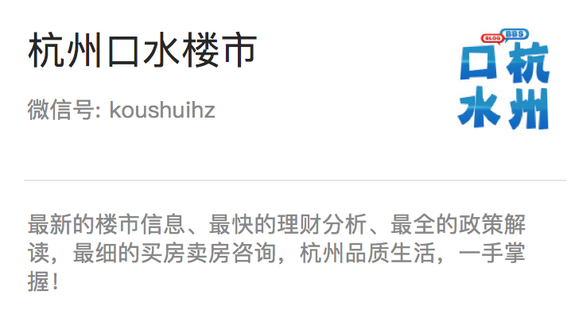

7) 杭州住保房管 —  住保房管的政策信息公布获取渠道

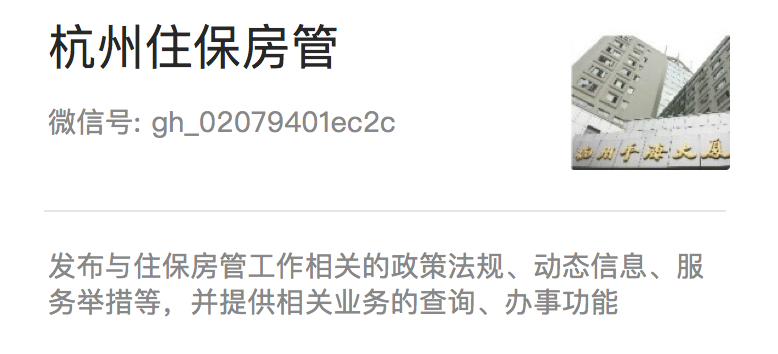

8) 杭州公安 —  便民查询，政策咨询

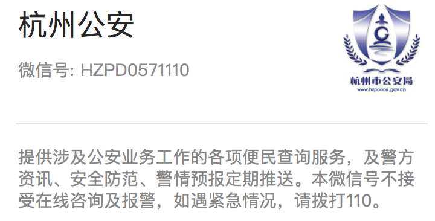

9) 钱江晚报 —  在浙江，新闻快，资讯多，服务全

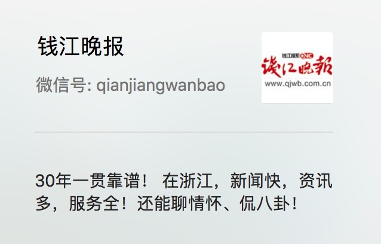

10)  层楼 —  个人评楼公众号(重点关注)

11)  独立评房 —  个人评楼公众号

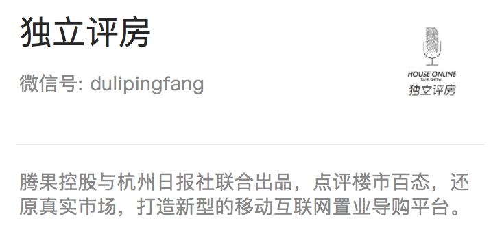

12) 维维说房 —  个人评楼公众号(重点关注)

13) 丁祖昱评楼 —  个人评楼公众号(重点关注)

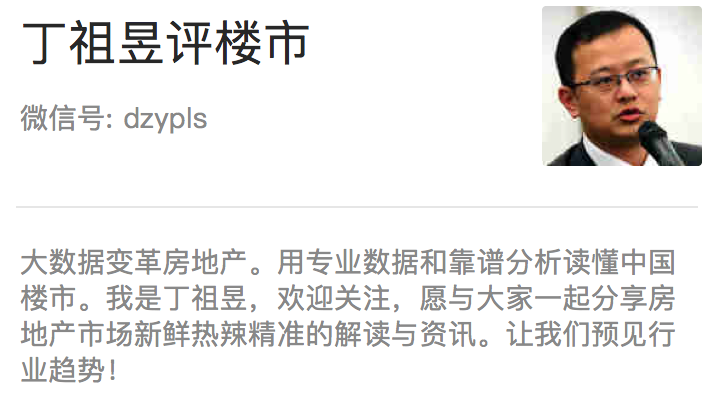

14) 严肃买房报告 —  个人评楼公众号

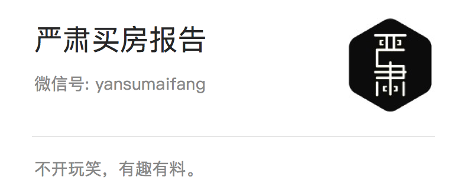

15) 微余杭 —  

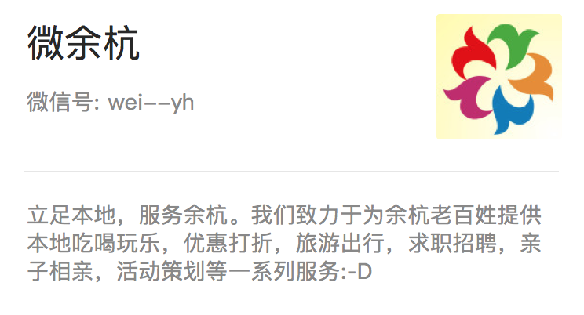

16) 今日拱墅 —  (重点关注)

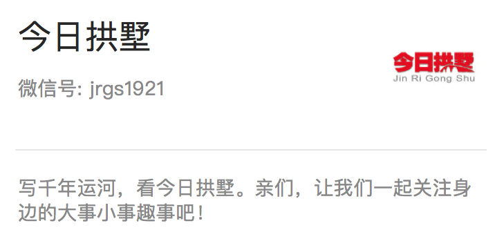

17) 杭州建设

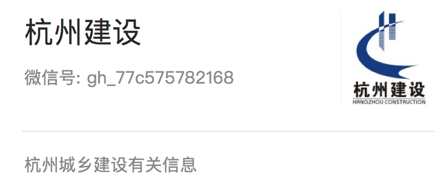

18) 乐活在杭州

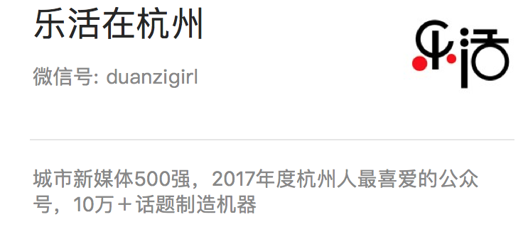

19) 良渚文化城

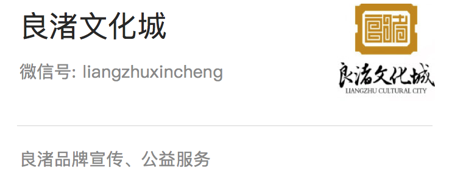

### 5.政府网站

[http://www.hzplanning.gov.cn/index.aspx?tabid=07c0f0db-9512-42f7-bf32-ce460a52e870](http://www.hzplanning.gov.cn/index.aspx?tabid=07c0f0db-9512-42f7-bf32-ce460a52e870)  杭州市测绘局

[http://www.yuhang.gov.cn/zmhd/wlwz/yggs/](http://www.yuhang.gov.cn/zmhd/wlwz/yggs/)  余杭  

[http://xxgk.xiaoshan.gov.cn/col/col1310582/index.html](http://xxgk.xiaoshan.gov.cn/col/col1310582/index.html) 萧山  

[http://www.gongshu.gov.cn/col/col1228928/index.html](http://www.gongshu.gov.cn/col/col1228928/index.html)  拱墅 

 [http://www.hzxh.gov.cn/col/col1177936/index.html](http://www.hzxh.gov.cn/col/col1177936/index.html) 西湖 

 [http://www.shangcheng.gov.cn/col/col1267801/index.html](http://www.shangcheng.gov.cn/col/col1267801/index.html) 上城

### 6.一些QQ群

Q群:322612404

Q群:284513258

## 五：<a name="地铁交通规划与现状">地铁交通规划与现状</a>

### 1.<a name="目前的杭州地铁">目前的杭州地铁(2018.02)</a>

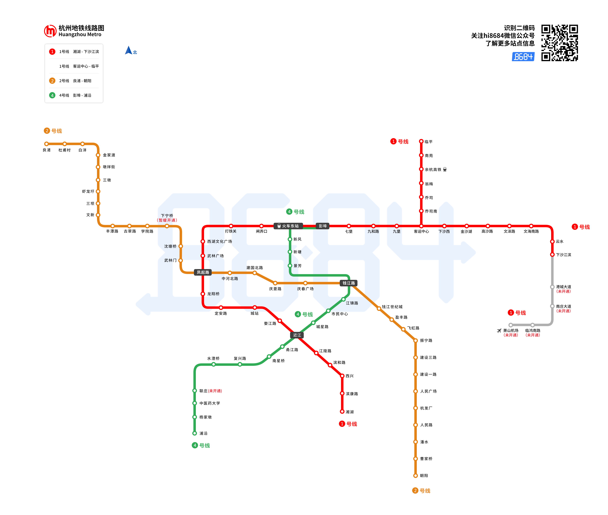

### 2.<a name="杭州三期地铁">杭州三期地铁</a>(2022)

[高清大图](attachments/1086212/1246136.jpg)

### 3. <a name="杭州地铁3期线路图">杭州地铁3期线路图</a>（卫星）
[高清大图](attachments/1086212/sanqiweixing.jpg)
感谢网友 ochinko

### 4. <a name="杭州市轨道交通远期建设规划">杭州市轨道交通远期建设规划</a>

### 5.<a name="当前杭州交通地图">当前杭州交通地图</a>(2017)

### 6.<a name="规划局杭州道路交通规划图2017版">规划局杭州道路交通规划图2017版(2022)</a>

（包含二绕，中环，杭甬高速调整为快速路）

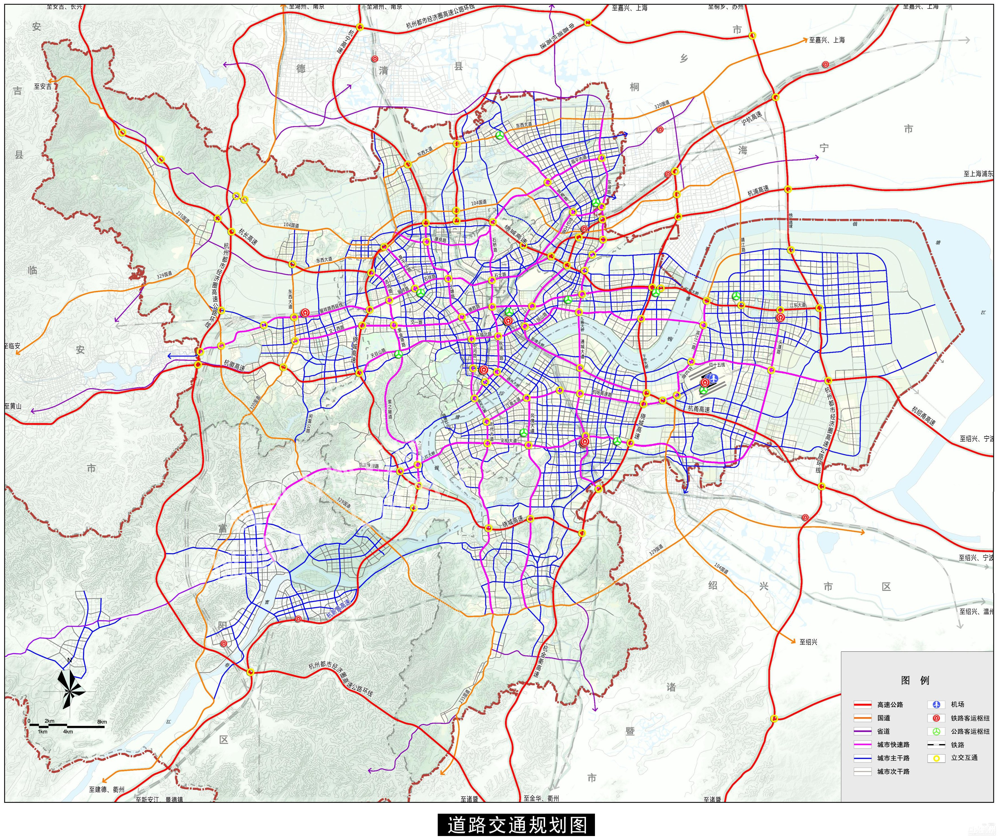

### 7.<a name="综合交通枢纽体系图">综合交通枢纽体系图</a>

 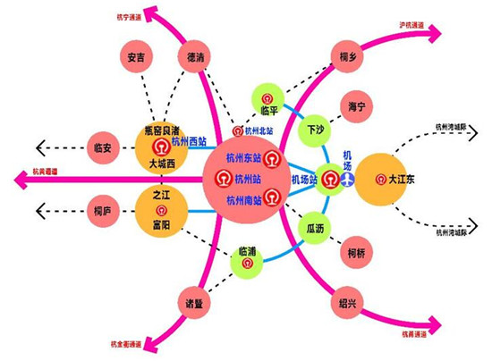

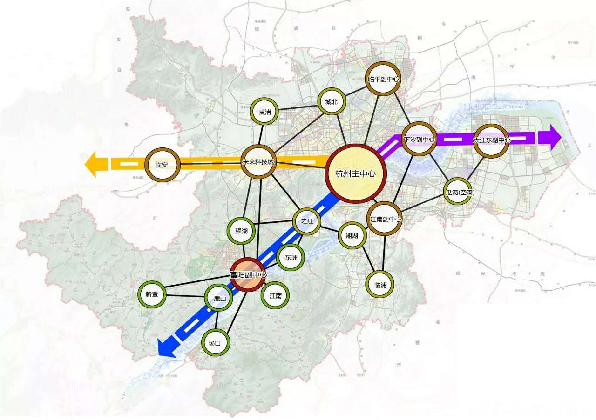

### 8.<a name="2018年开工">“杭州中环”2018年开工</a>

“杭州中环”为杭州都市区非收费快速公路。而中环打通后，只要花上40分钟，就能从临平到老余杭，时间缩短了近一半。
全线沟通了杭州义蓬、瓜沥、临浦、余杭、良渚、瓶窑等六大组团，以及临平副城、富阳区和嘉兴海宁、桐乡、绍兴柯桥等地。节点路段今年开工，全线力争2021年建成。

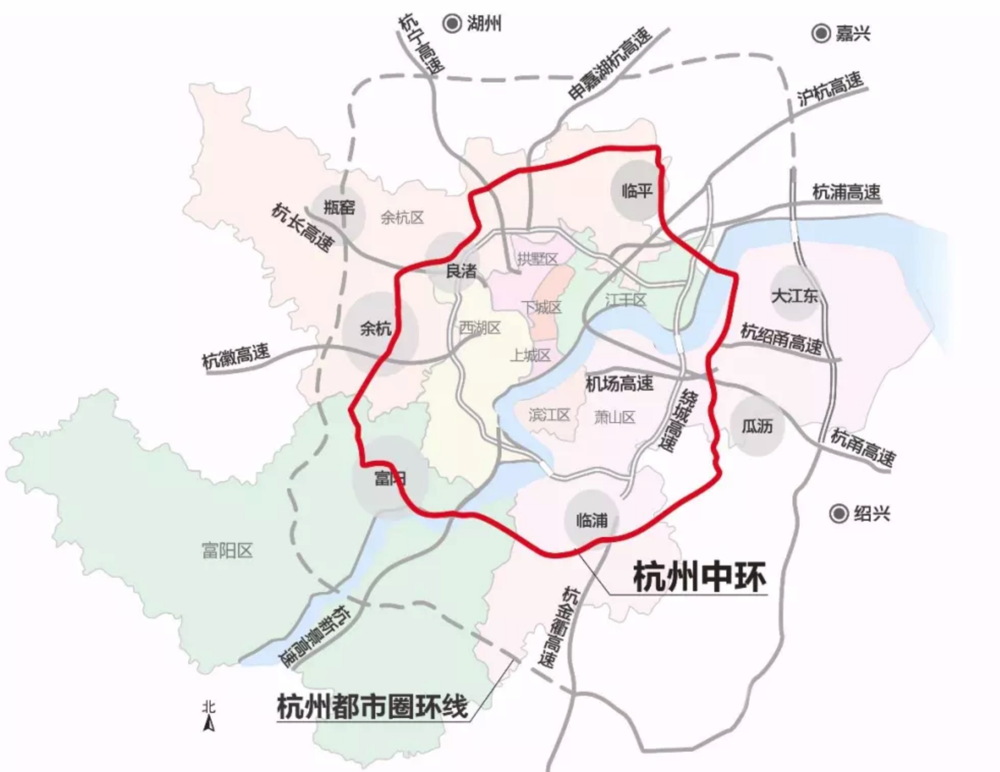

### 9.<a name="杭州水上巴士">杭州水上巴士</a>

[http://hz.bendibao.com/traffic/shuishangbus/](http://hz.bendibao.com/traffic/shuishangbus/)

### 10.<a name="亚运场馆建设">亚运场馆建设</a>

[杭州第一批亚运场馆建设安排出炉](http://zzhz.zjol.com.cn/xww/lskb/hz13179/201711/t20171116_5691511.shtml)

[杭州亚运会最新消息（持续更新）](http://hz.bendibao.com/news/2017926/70330.shtm)

## 六：<a name="拆迁">拆迁</a>

[杭州城中村拆迁时间一览表（更新中）](http://hz.bendibao.com/live/20171123/70814.shtm)

### 1.<a name="三改一拆是什么">三改一拆是什么</a>

       “三改一拆”指的是旧住宅区、旧厂区、城中村改造和拆除违法建筑。

　　旧住宅区改造范围

　　国有土地上与各镇街规划不相冲突，1997年前建造的无物业管理、无房屋维修基金，且存在功能不全、环境脏乱差等严重影响居民生活等问题的老旧住宅区。

　　 旧厂区改造范围

　　工业园区、企业集聚区内土地利用效率低的厂区；镇街建设区中与近期发展规划不符需改造的厂区；国家产业政策规定禁止类、淘汰类、限制类产业的厂区，以及其他需要改造的旧厂区。

　　城中村改造范围

　　主要是农村住房“二合一”改造建设项目（以宅基地换城镇公寓式住房与以承包地换城镇社保同步进行、一步到位，农民变居民）。

　　拆除违法建筑范围

　　对全区1999年以来违反土地管理等法律法规和城乡规划，未批先建、超标违建、乱搭乱建的违法建筑，历年立案查处的违法建筑，涉及旧住宅区、旧厂房和城中村改造的违法建筑进行重点清理整治。
### 2.<a name="2018拆迁大幕-主城要拆4万户、萧山8000户、临安1500户">2018拆迁大幕-主城要拆4万户、萧山8000户、临安1500户</a>
 [新闻链接](https://hz.focus.cn/zixun/4e167680f665d137.html)

截至去年12月，杭州共有69411户住户完成签约，完成69个村整村征迁“清零”。2018年杭州拆迁已拉开序幕.
杭州主城区计划再完成56个村的整村征迁，3个村的综合整治，同时全年完成住户拆迁4万户，确保80%以上安置房项目实现开工，回迁安置1万户。
据萧山区政府工作报告，2018年萧山将启动12个、力争完成20个以上城中村改造，拆迁农户8000户以上。
2018年，余杭拆迁工作继续进行。据余杭区2017-2019年城中村改造计划，2018年余杭区预计将完成拆迁3765户。
2017年临安全面推进32个区块改造项目，完成拆迁签约6219户、187万平方米，拆迁总量远超过去五年总和。
2018年临安计划实施城中村改造36个区块，完成拆迁1500户。
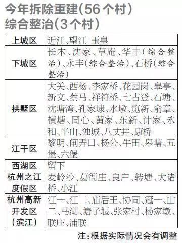

### 3.<a name="2018年棚户区改造计划">2018年棚户区改造计划(第三批)</a>

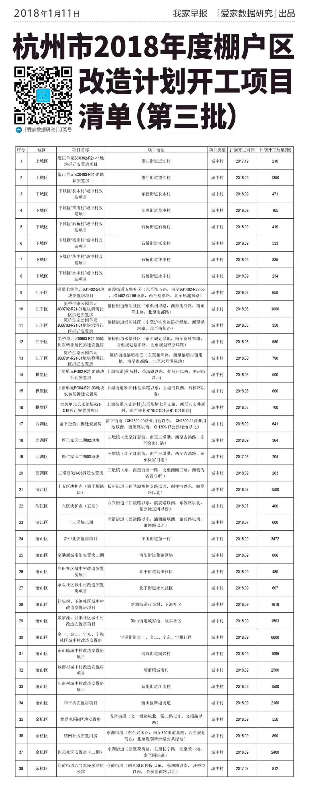

### 4.<a name="主城区城中村改造五年">主城区城中村改造五年（2016-2020）攻坚行动计划</a>

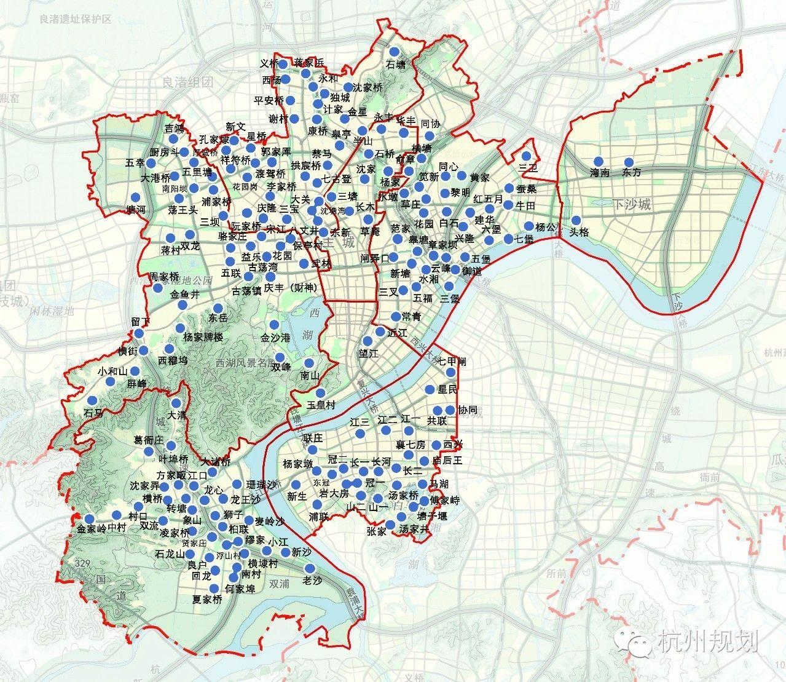

2017年1月，杭州主城区城中村改造攻坚行动被列入了《杭州市城市建设“十三五”规划》。作为全面实施“十三五”规划和市区城中村改造的攻坚之年。

### 5.<a name="2017年主城区拆迁表">2017年主城区拆迁表</a>

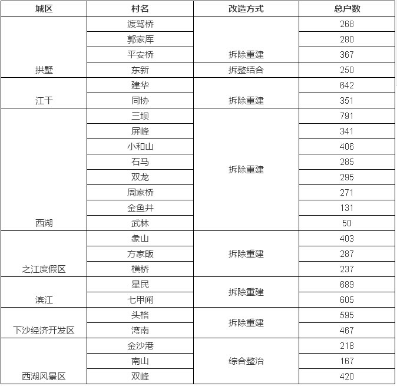

### 6.<a name="余杭区2017-2019年城中村改造示意图">余杭区2017-2019年城中村改造示意图</a>
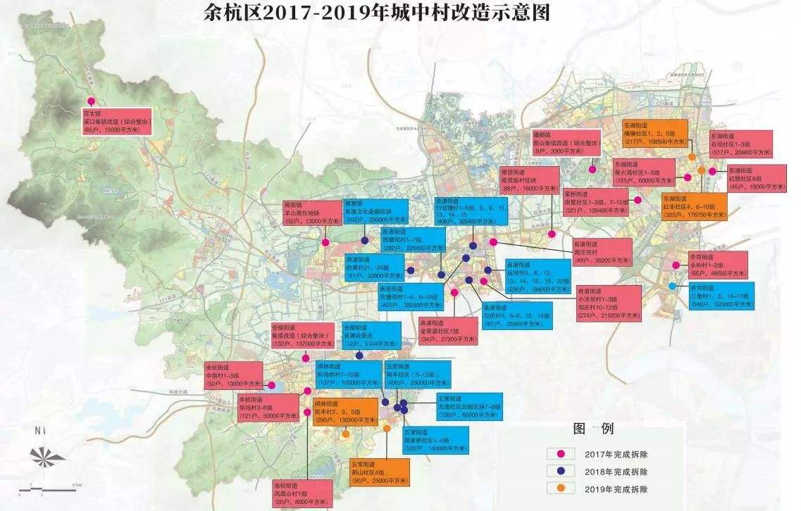

### 7.杭州各区拟订 2018 年“三改一拆”旧住宅区改造计划

截至2017年10月16日，杭州全市拆除违法建筑10856.1万平方米，

其中2017年拆除2106.4万平方米，完成今年1400万拆违目标任务的150.5%，拆后土地利用率72%；

累计“三改”13590万平方米，其中2017年完成2003.6万平方米，完成今年1435万“三改”目标任务的139.6%。

目前，各区正对照上述要求，结合实际开展前期勘察、设计，合理确定项目实施主体、范围、内容、工期、方案、经费等具体要素，编排项目计划和资金预算。

## 七：<a name="2017-2021年杭州市区住宅用地供应中期规划汇总表">2017-2021年杭州市区住宅用地供应中期规划汇总表</a>

<table class="confluenceTable"><colgroup><col /> <col /> <col /> <col /> </colgroup><tbody><tr><th rowspan="2" class="confluenceTh">序号</th><th rowspan="2" class="confluenceTh">城区</th><th colspan="2" class="confluenceTh">2017年住宅供应规模</th><th colspan="2" class="confluenceTh">2018年住宅供应规模</th><th colspan="2" class="confluenceTh">2019年住宅供应规模</th><th colspan="2" class="confluenceTh">2020年住宅供应规模</th><th colspan="2" class="confluenceTh">2021年住宅供应规模</th><th colspan="2" class="confluenceTh">5年合计</th></tr><tr><th class="confluenceTh">宗数</th><th class="confluenceTh">面积</th><th class="confluenceTh">宗数</th><th class="confluenceTh">面积</th><th class="confluenceTh">宗数</th><th class="confluenceTh">面积</th><th class="confluenceTh">宗数</th><th class="confluenceTh">面积</th><th class="confluenceTh">宗数</th><th class="confluenceTh">面积</th><th class="confluenceTh">宗数</th><th class="confluenceTh">面积</th></tr><tr><td class="confluenceTd">1</td><td class="confluenceTd">主城区</td><td class="confluenceTd">38</td><td class="confluenceTd">2271</td><td class="confluenceTd">41</td><td class="confluenceTd">2226</td><td class="confluenceTd">44</td><td class="confluenceTd">2240</td><td class="confluenceTd">39</td><td class="confluenceTd">2251</td><td class="confluenceTd">41</td><td class="confluenceTd">2365</td><td class="confluenceTd">203</td><td class="confluenceTd">11353</td></tr><tr><td class="confluenceTd">2</td><td class="confluenceTd">萧山区</td><td class="confluenceTd">35</td><td class="confluenceTd">2213</td><td class="confluenceTd">30</td><td class="confluenceTd">2522</td><td class="confluenceTd">37</td><td class="confluenceTd">2479</td><td class="confluenceTd">20</td><td class="confluenceTd">2452</td><td class="confluenceTd">17</td><td class="confluenceTd">2497</td><td class="confluenceTd">139</td><td class="confluenceTd">12163</td></tr><tr><td class="confluenceTd">3</td><td class="confluenceTd">大江东产业
 集聚区</td><td class="confluenceTd">10</td><td class="confluenceTd">564</td><td class="confluenceTd">8</td><td class="confluenceTd">709</td><td class="confluenceTd">8</td><td class="confluenceTd">745</td><td class="confluenceTd">8</td><td class="confluenceTd">810</td><td class="confluenceTd">8</td><td class="confluenceTd">820</td><td class="confluenceTd">42</td><td class="confluenceTd">3648</td></tr><tr><td class="confluenceTd">4</td><td class="confluenceTd">余杭区</td><td class="confluenceTd">25</td><td class="confluenceTd">1810</td><td class="confluenceTd">28</td><td class="confluenceTd">1999</td><td class="confluenceTd">21</td><td class="confluenceTd">1711</td><td class="confluenceTd">17</td><td class="confluenceTd">2071</td><td class="confluenceTd">21</td><td class="confluenceTd">1964</td><td class="confluenceTd">112</td><td class="confluenceTd">9556</td></tr><tr><td class="confluenceTd">5</td><td class="confluenceTd">富阳区</td><td class="confluenceTd">11</td><td class="confluenceTd">819</td><td class="confluenceTd">9</td><td class="confluenceTd">704</td><td class="confluenceTd">9</td><td class="confluenceTd">1184</td><td class="confluenceTd">5</td><td class="confluenceTd">925</td><td class="confluenceTd">7</td><td class="confluenceTd">975</td><td class="confluenceTd">41</td><td class="confluenceTd">4607</td></tr><tr><td colspan="2" class="confluenceTd">合计</td><td class="confluenceTd">119</td><td class="confluenceTd">7677</td><td class="confluenceTd">116</td><td class="confluenceTd">8160</td><td class="confluenceTd">119</td><td class="confluenceTd">8359</td><td class="confluenceTd">89</td><td class="confluenceTd">8509</td><td class="confluenceTd">94</td><td class="confluenceTd">8622</td><td class="confluenceTd">537</td><td class="confluenceTd">41327</td></tr></tbody></table>

## 八：<a name="土拍分析">土拍分析</a>

### 1. <a name="透明售房网-杭州土地市场分析">[透明售房网-杭州土地市场分析](http://www.tmsf.com/info/search_262150040_33.htm)</a>

### 2. <a name="近一年土地成交档案">近一年土地成交档案 2018.02</a>

来自网友 “啊呀呀～～真是的” 提供的土地出让信息整理表

[2015年-2018年土地出让信息.docx](attachments/1086212/2015年-2018年土地出让信息.xlsx)

（主城区及部分萧山、余杭热点地块)

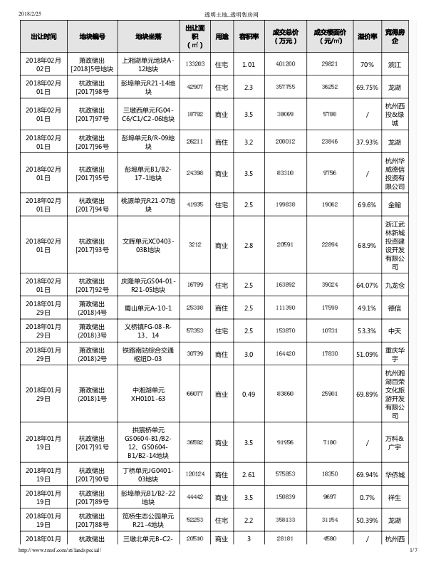
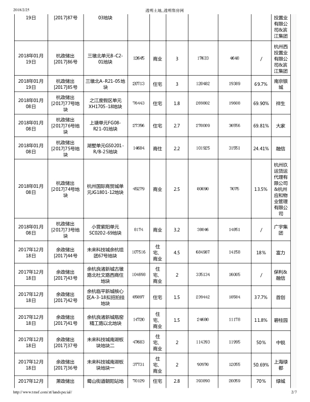
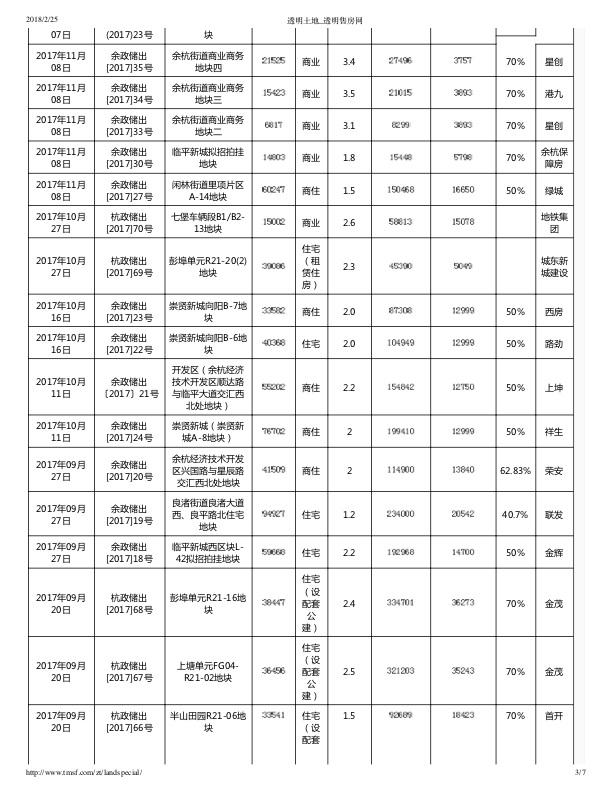
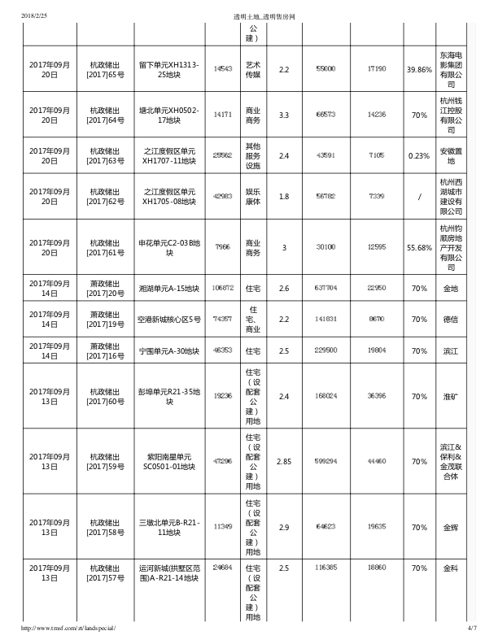
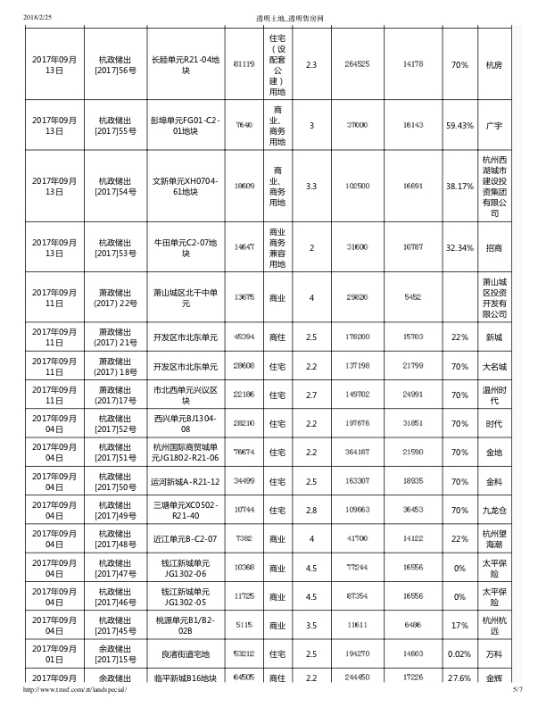
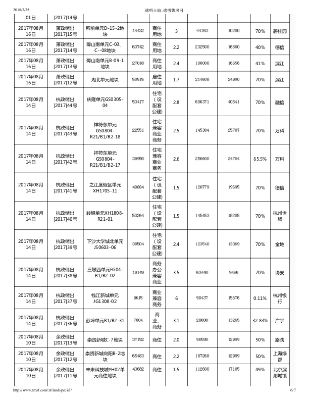

## 九：<a name="2020年人口目标">2020年人口目标</a> 

2016年底，按年末常住人口统计，北京是2172.9万人，上海是2419.7万人，广州是1404.35万人，深圳是1190.84万人。而杭州是多918.8万人。

哪怕是与现在人口最少的深圳相比，未来几年的杭州，起码也还要增加近300万人，才能在人口规模上，初步赶上深圳。

杭州上报国务院批复的《杭州市城市总体规划（2001-2020）（2016年修订）》（以下简称《总体规划》）中，到2020年时的人口目标，是1000万。

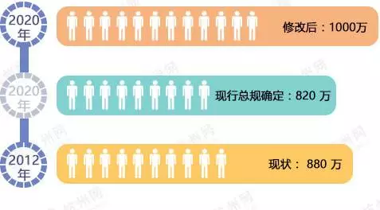

按照《2017年杭州人才引进政策》，杭州的目标是，到2020年，人才数量达到约250万人。 

也就是说，1000万人的杭州，每4个人中，就有一个是人才。

即将来到杭州的80万人，会留在杭州的哪些地方？？？

按照《总体规划》：“城市规模方面，到2020年，中心城区常住人口控制在400万人以内。”

而截至到2016年底，一直被称为杭州主城区的地方，加起来的人口，已经超过371万。 

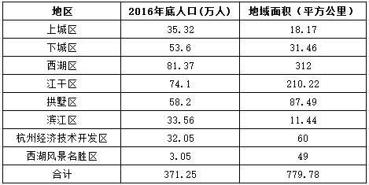

这也就意味着，2017-2020这四年中，主城区引进的人才，不到29万。如果扣除主城区的自然增长，如按2016年的28440人（出生37504人减去死亡9064人）静态增长计算，这4年主城区自然增长的人口也会超过11万。 

也就是说，如果真的按照400万人的人口指标来控制，主城区的人才导入，未来几年，只有区区不到18万。

所以就明白，为何杭州会停止购房落户了。再不停止，人才的名额，都被有钱的土豪抢走了。 

而剩下的62万人才们，不好意思，只能到主城区以外的地方去了。

主城区以外的地方，都在这里。

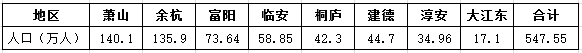

这些地方，占据了杭州60%的人口。尤其是萧山和余杭，加起来有276万人，占比超过一半。 

而其中，属于杭州城区的萧、余、富、临四区，人口加起来高达408.49万，比主城区的人口还多了37万多。 

未来，引进的人才，大部分落到主城区之外的地方，这些地方的人口比重，还会提升。

由中心向周边疏导、多组团、多副中心并驾齐驱的分布，将是未来杭州的城市格局。

这与当前《总体规划》的原则、方向，还有政府的卖地分布、产业规划，密不可分。 

按照《总体规划》，除了“一主三副”（一主城及江南、临平、下沙三副城）格局不变，有些细微的变化，比如，塘栖组团不见了： 

新的六大组团，分别是：余杭组团（未来科技城）、良渚组团、瓶窑组团、义蓬组团（大江东新城）、瓜沥组团和临浦组团。

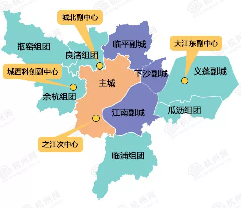

## 十：<a name="杭州重点发展项目">杭州重点发展项目</a>

“十三五”时期重点培育的17个增长极

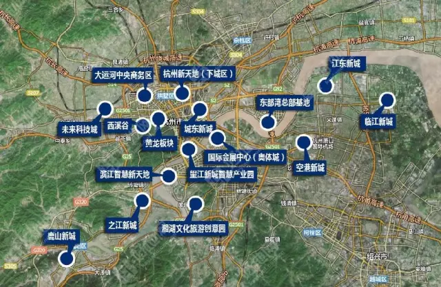

 城东新城、国际会展中心（奥体城）、望江新城智慧产业园、西溪谷、大运河中央商务区、东部湾总部基地、未来科技城、滨江智慧新天地、

杭州新天地（下城区）、之江新城、黄龙板块、江东新城、临江新城、空港新城、湘湖文化旅游创意园、鹿山新城、特色小镇。

### 1.城东新城

### 2.国际会展中心（奥体城）

### 3.望江新城智慧产业园

### 4.西溪谷

### 5.大运河中央商务区

### 6.东部湾总部基地

### 7.未来科技城

### 8.滨江智慧新天地

### 9.杭州新天地（下城区）

### 10.之江新城

### 11.黄龙板块

### 12.江东新城
大江东产业集聚区管委会发布了杭州江东站枢纽战略研究采购公告。2月12日，中标结果公布。规划有多个重点，包括江东枢纽站的选址规划、功能定位、线路对比等，都提上了日程。
，根据中国铁路总公司和浙江省人民政府联合批复的《杭州铁路枢纽规划（2016－2030年）》，提出杭州铁路枢纽将形成“一轴（沪昆、宁杭甬通道）两翼（城西通道和江东通道）”总体布局，新建杭州西站、江东站和萧山机场站。

根据铁路枢纽规划，江东站主要办理大部分区域城际动车、枢纽环线市域客车始发终到及通过作业，规划有杭绍台铁路、沪乍杭铁路引入江东站，同时通过杭州南站至江东站联络线，可将杭长、杭甬、杭黄等铁路引入江东火车站。江东站将成为杭州江东区域城际动车始发终到的铁路枢纽站。
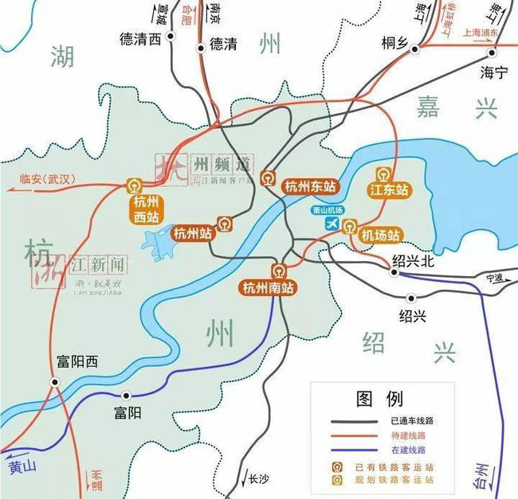

### 13.临江新城

### 14.空港新城

### 15.湘湖文化旅游创意园

### 16.鹿山新城

### 17.特色小镇

## 十一：<a name="杭州市政规划">杭州市政规划</a>

<a name="新增各地区控规文件">新增各地区控规文件</a>

[杭州轨道交通专项规划](attachments/files/杭州轨道交通专项规划.zip)

[杭州体育设施规划图](attachments/files/杭州体育设施规划图.zip)

[钱江世纪城控规](attachments/files/钱江世纪城控规.zip)

[余杭分区规划1](attachments/files/余杭分区规划1.zip)

[余杭分区规划2](attachments/files/余杭分区规划2.zip)

[余杭分区规划3](attachments/files/余杭分区规划3.zip)

[古荡西溪玉泉控规](attachments/files/古荡西溪玉泉控规.zip)

[杭州北部新城规划图](attachments/files/杭州北部新城规划图.zip)

[蒋村单元控规](attachments/files/蒋村单元控规.zip)

[留下控规](attachments/files/留下控规.zip)

[申花单元控规](attachments/files/申花单元控规.zip)

[双桥三墩北控规](attachments/files/双桥三墩北控规.zip)

[下沙中心控规](attachments/files/下沙中心控规.zip)

[祥符单元控规](attachments/files/祥符单元控规.zip)

[之江转塘控制规划](attachments/files/之江转塘控制规划.zip)

0.[2019年度杭州市经营性用地出让、收储和做地计划地块汇总表](attachments/1086212/2019年度杭州市经营性用地出让、收储和做地计划地块汇总表.xls)

1.[杭州市政五年规划](http://www.hzghy.com.cn/index.php/project/info/45/51)

2.[2017年杭州市政府工作报告](http://www.hangzhou.gov.cn/art/2017/4/17/art_1310230_6408403.html)

3.[杭州往事，十年一觉杭州梦](https://baijia.baidu.com/s?id=1573626444723531&amp;wfr=pc&amp;fr=app_lst)

4.[&#26477;&#24030;&#24066;&ldquo;&#21313;&#19977;&#20116;&rdquo;&#37325;&#22823;&#24314;&#35774;&#39033;&#30446;&#34920;.docx](attachments/1086212/1246005.docx)

5.[杭州各区拟定2018拆迁改造计划;六个火车站!杭州中轴快线、中环规划出炉](https://hz.focus.cn/zixun/7d09483e4380904a.html)

## 十二:<a name="关于学区">关于学区</a>

### 1.<a name="分表制度">分表制度</a>

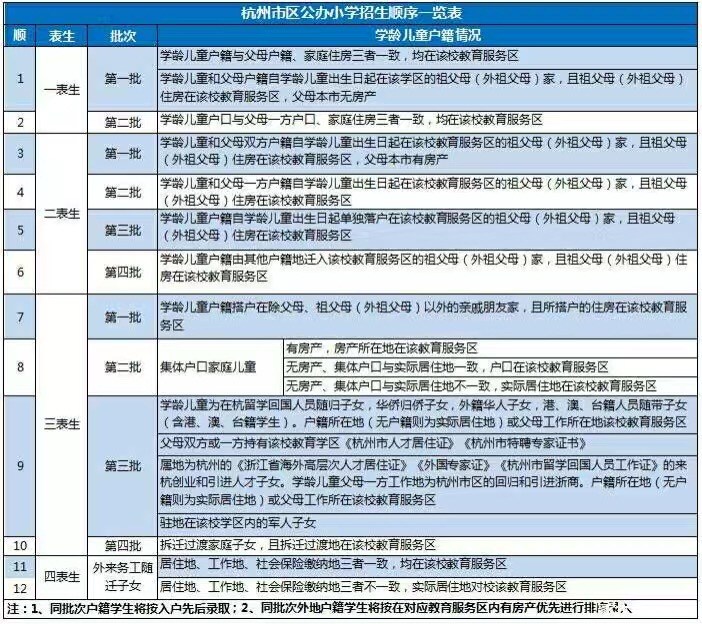

### 2.<a name="学区划分">学区划分</a>

[2018杭州各区小学学区划分汇总（更新中）](http://hz.bendibao.com/edu/2016330/64901.shtm)

[2017年杭州城区学区划分](http://www.19lou.com/forum-263-thread-6631457491565752-1-1.html)

[2017杭州各区学区划分大汇总](https://www.kan3721.com/news/show-7932.html)

## 十三: <a name="配套设施分析">配套设施分析(道路，医院，学校，综合体)</a>
### 1.<a name="综合体">综合体</a>
杭州各城区中大型购物中心数量、体量分布情况（商业面积≥5万㎡的购物中心）【截止到2018.02】
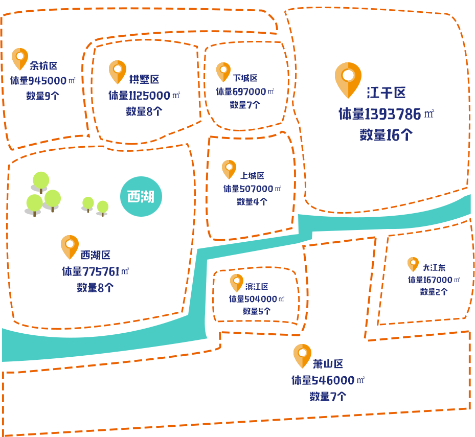

<table cellpadding="0" cellspacing="3"> <tbody><tr> <th>城区</th> <th>板块</th> <th>项目名称</th> <th>项目地址</th> <th>商业面积（㎡）</th> </tr> <tr> <td rowspan="4">上城区</td> <td>市中心</td> <td>湖滨银泰IN77-A/B/C/D/E</td> <td>上城区延安路258号</td> <td>207000</td> </tr> <tr> <td>市中心</td> <td>西湖银泰城</td> <td>上城区延安路98号</td> <td>70000</td> </tr> <tr> <td>市中心</td> <td>利星尚城1157</td> <td>上城区中山南路77号</td> <td>100000</td> </tr> <tr> <td>市中心</td> <td>杭州解百购物广场</td> <td>延安路179号(近解放路)</td> <td>130000</td> </tr> <tr> <td rowspan="7">下城区</td> <td>市中心</td> <td>嘉里中心</td> <td>下城区延安路353号</td> <td>108000</td> </tr> <tr> <td>市中心</td> <td>杭州大厦购物中心</td> <td>武林广场1号</td> <td>180000</td> </tr> <tr> <td>市中心</td> <td>国大城市广场</td> <td>延安路609号</td> <td>60000</td> </tr> <tr> <td>市中心</td> <td>武林广场地下商场</td> <td>武林广场</td> <td>66000</td> </tr> <tr> <td>华丰</td> <td>阳光银泰城</td> <td>东新路822号</td> <td>100000</td> </tr> <tr> <td>新天地</td> <td>新天地购物中心</td> <td>下城长浜路与新天地街交叉口</td> <td>120000</td> </tr> <tr> <td>新天地</td> <td>新天地G193生活广场</td> <td>下城长浜路（原东新东路）与安桥路交叉口</td> <td>63000</td> </tr> <tr> <td rowspan="8">拱墅区</td> <td>祥符</td> <td>万融城</td> <td>祥富路与杨家浜路东南角</td> <td>70000</td> </tr> <tr> <td>祥符</td> <td>万达广场</td> <td>杭行路666号</td> <td>167000</td> </tr> <tr> <td>桥西</td> <td>天阳D32</td> <td>小河路306号</td> <td>80000</td> </tr> <tr> <td>申花</td> <td>城西银泰城</td> <td>丰潭路380号</td> <td>290000</td> </tr> <tr> <td>大关</td> <td>运河上街</td> <td>金华路80号</td> <td>80000</td> </tr> <tr> <td>大关</td> <td>水晶城</td> <td>上塘路458号</td> <td>88000</td> </tr> <tr> <td>大关</td> <td>远洋·乐堤港</td> <td>大关路与丽水路交叉口</td> <td>150000</td> </tr> <tr> <td>申花</td> <td>中粮·大悦城</td> <td>拱墅区莫干山路与隐秀路交叉口</td> <td>200000</td> </tr> <tr> <td rowspan="8">西湖区</td> <td>西溪</td> <td>西溪印象城一、二期</td> <td>五常大道1号</td> <td>210000</td> </tr> <tr> <td>西溪</td> <td>西溪银泰城</td> <td>文一西路与崇仁路交叉口</td> <td>115000</td> </tr> <tr> <td>西溪</td> <td>龙湖西溪天街</td> <td>蒋村</td> <td>130000</td> </tr> <tr> <td>文教区</td> <td>西城广场</td> <td>文二西路551号</td> <td>55500</td> </tr> <tr> <td>市中心</td> <td>黄龙万科中心一期</td> <td>学院路77号</td> <td>65000</td> </tr> <tr> <td>三墩</td> <td>龙湖紫金天街</td> <td>三墩</td> <td>67500</td> </tr> <tr> <td>紫金港</td> <td>古墩印象城</td> <td>古墩路588号</td> <td>52761</td> </tr> <tr> <td>紫金港</td> <td>五洲国际广场</td> <td>西湖区余杭塘路799号</td> <td>80000</td> </tr> <tr> <td rowspan="16">江干区</td> <td>钱江新城1期</td> <td>天虹百货</td> <td>新塘路108号中豪五福新天地</td> <td>73000</td> </tr> <tr> <td>钱江新城1期</td> <td>庆春银泰</td> <td>景昙路18-26号</td> <td>60000</td> </tr> <tr> <td>钱江新城1期</td> <td>杭州大厦501城市广场</td> <td>景昙路16号</td> <td>60000</td> </tr> <tr> <td>钱江新城1期</td> <td>万象城</td> <td>钱江新城锦路、民心路交叉口</td> <td>224000</td> </tr> <tr> <td>钱江新城1期</td> <td>凯德来福士</td> <td>新业路228号</td> <td>116000</td> </tr> <tr> <td>钱江新城1期</td> <td>高德置地广场</td> <td>钱江新城解放东路45号</td> <td>100000</td> </tr> <tr> <td>钱江新城1期</td> <td>砂之船波浪文化城</td> <td>江干区解放东路8号</td> <td>50000</td> </tr> <tr> <td>下沙金沙湖</td> <td>银泰百货下沙工厂店</td> <td>海达南路与下沙路交叉口西南角</td> <td>98000</td> </tr> <tr> <td>下沙金沙湖</td> <td>龙湖·金沙天街</td> <td>下沙金沙大道560号</td> <td>101700</td> </tr> <tr> <td>下沙金沙湖</td> <td>金沙印象城</td> <td>金沙湖</td> <td>56686</td> </tr> <tr> <td>下沙金沙湖</td> <td>国芳购物中心</td> <td>九沙大道以南、九乔路以北、久福路以东、久盛路以西</td> <td>100000</td> </tr> <tr> <td>下沙开发区</td> <td>下沙宝龙城市广场</td> <td>浙江工商大学北门对面</td> <td>100000</td> </tr> <tr> <td>下沙开发区</td> <td>福雷德广场</td> <td>文泽路99号</td> <td>64000</td> </tr> <tr> <td>城东新城</td> <td>杭州中央车站广场</td> <td>江干区东宁路与鸿泰路交叉口</td> <td>104,000</td> </tr> <tr> <td>城东新城</td> <td>杭州港龙城</td> <td>明月桥路与鸿泰路交叉路口</td> <td>100000</td> </tr> <tr> <td>城东新城</td> <td>东站西子国际</td> <td>彭埠街道东宁路新和嘉苑北350米</td> <td>80000</td> </tr> <tr> <td rowspan="5">滨江区</td> <td>滨江区政府</td> <td>星光大道一期</td> <td>江南大道228号</td> <td>70000</td> </tr> <tr> <td>滨江区政府</td> <td>星光大道二期</td> <td>滨盛路光辉路交叉口</td> <td>87000</td> </tr> <tr> <td>滨江区政府</td> <td>龙湖·滨江天街</td> <td>江汉路1515号</td> <td>147000</td> </tr> <tr> <td>一桥南</td> <td>滨江宝龙城市广场</td> <td>火炬大道与江南大道交汇处</td> <td>140000</td> </tr> <tr> <td>一桥南</td> <td>世茂中心</td> <td>浦沿街道信诚路817号</td> <td>60000</td> </tr> <tr> <td rowspan="7">萧山区</td> <td>萧山市北</td> <td>萧山宝龙城市广场</td> <td>建设一路与金鸡路交叉口</td> <td>60000</td> </tr> <tr> <td>萧山新区</td> <td>银隆百货</td> <td>市心中路288号</td> <td>122000</td> </tr> <tr> <td>萧山新区</td> <td>lse城市生活广场</td> <td>金城路333号</td> <td>60000</td> </tr> <tr> <td>萧山新区</td> <td>恒隆广场</td> <td>工人路与山阴路交叉口东北角</td> <td>60000</td> </tr> <tr> <td>萧山新区</td> <td>旺角城新天地</td> <td>市心中路123号</td> <td>80000</td> </tr> <tr> <td>萧山新区</td> <td>华润万象汇</td> <td>市心路与金城路交叉口</td> <td>104000</td> </tr> <tr> <td>瓜沥镇</td> <td>杭州瓜沥七彩小镇</td> <td>瓜沥镇建设四路与光华路交汇处</td> <td>60000</td> </tr> <tr> <td rowspan="9">余杭区</td> <td>北部新城</td> <td>西田城一、二期</td> <td>金家渡路8号</td> <td>100000</td> </tr> <tr> <td>良渚</td> <td>永旺梦乐城</td> <td>古墩路1888号</td> <td>140000</td> </tr> <tr> <td>临平南苑</td> <td>莱蒙商业中心</td> <td>藕花洲大街与迎宾路交汇处</td> <td>50000</td> </tr> <tr> <td>临平南苑</td> <td>临平理想银泰城</td> <td>余杭区世纪大道与迎宾路</td> <td>180000</td> </tr> <tr> <td>临平南苑</td> <td>余之城</td> <td>迎宾路和临东路交界</td> <td>110000</td> </tr> <tr> <td>临平山北</td> <td>万宝城</td> <td>荷禹路北沙西路交汇处</td> <td>120000</td> </tr> <tr> <td>良渚</td> <td>金地广场</td> <td>古墩路与金渡北路口</td> <td>65000</td> </tr> <tr> <td>未来科技城</td> <td>西溪·北大资源海港城</td> <td>文一西路与荆长大道交叉口</td> <td>100000</td> </tr> <tr> <td>未来科技城</td> <td>华元西溪欢乐城</td> <td>未来科技城五常大道与华丰路西南方向</td> <td>80000</td> </tr> <tr> <td rowspan="2">大江东</td> <td>江东新城</td> <td>大江东宝龙城市广场</td> <td>江东大道与横一线交叉口</td> <td>67000</td> </tr> <tr> <td>江东新城</td> <td>大江东龙湖天街</td> <td>东南至国环三路、西至青六路、北至北二路</td> <td>100000</td> </tr> </tbody></table>

今年将要开业的综合体更多，初步统计下大约有30个，其中有和来福士隔市民中心相望的高德置地广场，还有让人期待已久的大悦城等

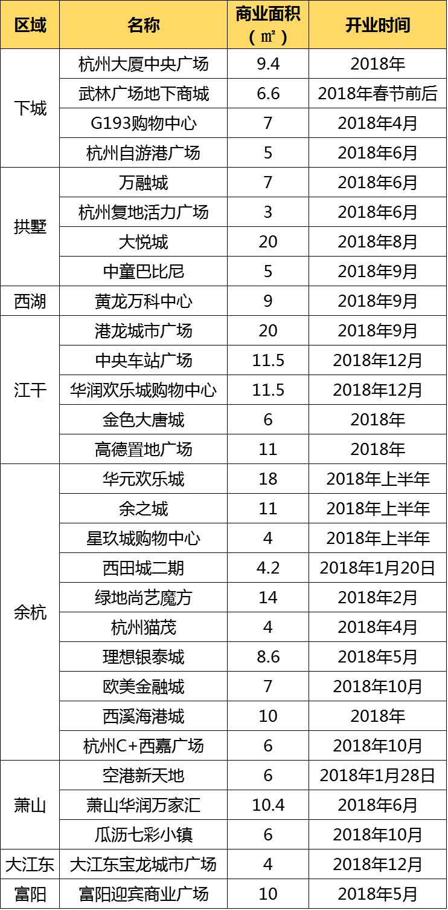

### 2.<a name="学校">学校</a>
### 3.<a name="医院">医院</a>

## 十四: <a name="各区域详细规划与价值分析">各区域详细规划与价值分析</a>

[https://mp.weixin.qq.com/s/LXzDLVNGy9iybiw-Ic2ovA](https://mp.weixin.qq.com/s/LXzDLVNGy9iybiw-Ic2ovA)

### **1.上城区**

**努力挖掘地下发展空间,****开发龙翔地下综合体、吴山广场地下综合体……**

**核心定位：杭州中央活动区（CAZ）。**

地铁规划：上城区内规划的轨道交通线路有地铁1号线、4号线、5号线、7号线，共13个站点。

按照《杭州市上城分区规划（2017-2020年）》，未来的上城区将打造成“杭州中央活动区”（CAZ）。

“中央活动区”（CAZ）听起来和中央商务区（CBD）差不多，事实上，“中央活动区”既包含了中央商务区的商业、商务功能，同时又增加了创新、文化、旅游等要素，功能更加综合，更突出人的体验和活动。

上城区有众多的历史街区与文化保护区，未来，这些地方在发展中将与“杭州中央活动区”的定位充分结合。

比如，南宋文化保护区、吴山文化保护区将与旅游相结合；中山中路传统商业街区、清河坊历史街区、五柳巷历史地段、十五奎巷历史地段等将主要发掘商贸功能；泗水坊历史地段、思鑫坊近代民居保护区将与居住相结合；而南宋皇城遗址、勾山里历史街区将利用独特的空间环境成为文化创意产业的生长区。

另外，上城区是杭州市面积最小的城区，又因为西湖景区、钱塘江水源保护区、历史文化遗产保护要求的限制，区域发展空间有限。

所以，未来上城区将更多地挖掘地下空间。

其中，龙翔地下综合体、西湖大道延安南路地下商业街、吴山广场地下综合体、湖滨西湖电影院周边地下综合体、城站东广场地下综合体、望江新城地下综合体、婺江路地下商业街会是今后开发的重点。

### **2.下城区**

**在石桥一带建武林新城**

**到2020年规划建7所初中、22所小学**

**核心定位：全域中央商务区**

地铁规划：下城区内规划的轨道交通线路有1号线、2号线、3号线、4号线、5号线、机场快线，共16个站点。远期考虑在华丰地区引入轨道交通。

这次规划，下城区北部变化最大，在石桥一带，要打造一个全新的武林新城。

在武林新城里，将打造一个以电竞数娱产业为核心的电竞数娱小镇，重点发展电竞及其相关产业、信息产业等。

未来，下城区将以幸福民生为方向，进一步提升设施品质，保障教育、医疗、体育、文化、养老等民生设施的供给。

以教育为例，至2020年规划建初中7所、小学22所、九年一贯制学校5所、特殊学校1所。这些学校大多集中在下城区北部。

在东新路西侧，中大银泰城对面，规划建设9班规模公建配套塘河幼儿园（暂名）。

在白石巷以北，漾河弄以南，规划建设30班的三塘单元规划中学。

三塘单元灯塔小学(暂名)，规划位于善贤路和红西河东南侧，30班规模。三塘单元规划幼儿园(暂名)则位于三塘单元灯塔小学西侧，9班规模。东新单元的沈家幼儿园(暂名)规划位于沈家北苑，15班规模。

其中，三塘中学、灯塔小学、万家星城学校、沈家幼儿园、沈家小学、东新幼儿园，会在最近两三年内建设。

### 3.<a name="西湖区">西湖区</a>

**重点发展之江和三墩区块**

**加强南北两翼交通联系**

**核心定位：国际化示范区&amp;最美城区**

地铁规划：西湖区规划有地铁2号线、3号线、4号线、5号线、6号线、10号线，远期考虑将加密紫金港科技城、双桥、之江等地的轨道线网。

西湖区是杭州主城区面积最大的城区，一南一北的之江和三墩区块，发展相对滞后，这南北两翼是目前西湖区重点开发的区域。在这次分区规划中，也特别强调了这两个区块在公共服务方面的均等发展。

在教育方面，西湖区近期重点推进的西湖大学、云谷公学、之江第一中学、之江一小、麦岭沙小学等都在之江和三墩；

在医疗、文化等方面，未来之江和三墩地区将新增之江医院、西湖区中西医结合医院、三墩镇文体中心、省级文化城、三墩镇文体中心等。

交通方面，南北两翼交通联系，加强各大功能板块的互动也是规划重点。

目前南北两翼只有紫之隧道贯通，或者只能走绕城，接下去要结合留泗路、桐坞路等次干路，打通断头路，连接次干路，让南北连接可以有更多的选择。

在特色小镇方面，西湖区一直走在杭州乃至全省的前列，未来西湖区将形成“两翼三圈六镇多园”的产业格局——

“两翼”是紫金港科技城、双浦新区；

“三圈”是黄龙商圈、蒋村商圈、之江金融港商圈；

“六镇”是云谷小镇、紫金众创小镇、西溪谷互联网金融小镇、工创小镇、艺创小镇、云栖小镇； “多园”是“福地创业园模式”“蘑菇街创意园”等多个特色园区。

### 4.<a name="江干区">江干区</a>

**拟规划全新城市空中过街系统**

**打造遍布全区慢行绿道**

**核心定位：城市新中心、创新新天堂、国际新窗口、智慧新城区**

地铁规划：有地铁1号线、2号线、3号线、4号线、6号线、7号线、9号线、中轴快线。总体来看，西部线网密集，东部较弱。

远期，2020年-2035年，城东新城、钱塘智慧城、笕桥、丁兰新城轨道交通水平将得到加强，计划建设轨道交通网络总里程约80公里，站点800米服务半径覆盖率达到70%。

江干区是拥江发展的重点区域，可以说是全域拥江。

江干区规划打造遍布全区的慢行绿道系统，譬如之江路快车道下沉，上面打造大型江滨公园，人们可以直接走到江边。

而通过江滨绿道、白石港绿道、运河绿道、和睦港绿道、上塘河皋亭山绿道等50多公里的慢跑道和自行车道，沿途串联各个公园系统，把整个江干连接在一起，打造全新慢生活。

在重点商圈和主要商务办公区域，江干区拟论证规划全新的城市空中过街系统。

参考国际化城市的范例，在具有活力型的商务区增加花园式过街系统，增加业态互动。例如纽约的高线公园，这是一个将废弃高架路改造为空中走廊，增添各类绿化，沿线布置咖啡吧、甜品店等业态，连接各大商场，增添商业区活力。

而在写字楼密集的商务办公区，则着重于商务过街系统，譬如通过各类过街天桥，快速连接各写字楼。

停车方面，江干区规划了社会公共停车设施140余处，合计停车泊位约3万个。

并考虑逐步实施差别化停车政策，比如，将采荷、四季青等老城区划为适度限制区，一方面通过存量挖潜、错峰停车来增加社区机动车位，一方面也要通过加强公共交通服务水平来降低小汽车出行需求；在东北部外围片区，在全面加强停车配建能力的同时，也要根据轨道交通网络覆盖情况，根据所处区位不同，制定差异化的停车策略；而钱江新城等城市新中心核心地带，将大幅提高公交出行比例。

### 5.<a name="下沙">下沙</a>

还要建设26所小学、11所中学 5所九年一贯制学校

核心定位：国家级开发区转型升级示范区、城东智造大走廊的引领区、一流的现代化国际化新城区。

和其他城区比起来，下沙可继续开发的增量用地显得非常充足，有8平方公里，并且有10平方公里存量用地要转型升级。这些足以推动区域升级。

比如，北部生物医药产业区块，这里大部分用地尚未开发建设，未来将以医药港小镇建设为抓手进行建设。在东部湾现代服务产业区块，也就是现在之江东路和绕城高速的交叉口，也有大部分用地未建设，这里刚好是钱塘江转弯口，将来要打造现代商务服务为主的南部门户。

道路建设：下沙的主战场区域内的主次干道，下沙的主干道以“五纵四横”为主，“四横”即五一路、农垦路、6号大街、20号大街；“五纵”是聚首路、海达路、文泽路、文津路、文海路/23号大街。这些道路中间，还要开辟更多的次干道，打通各条断头路，让“毛细血管”分流“主动脉”的交通压力。

文体设施：规划的9处市区级文体设施，主要分布金沙湖中心区，七格沿江片区以及东部湾片区。

医院：完善公立医疗机构配置，满足居民多层次、多元化的医疗服务需求，在现状邵逸夫医院、东方医院的基础上在东部湾片区增设国际医院，在大学城北片区增设大学城北医院，完善各片区的社区卫生服务中心配套。

学校：在教育设施配套上，按照服务半径300米控制，规划共布置51所幼儿园，共计695班，以每班30人来算，可以解决2万多孩子的入学问题。除了幼儿园，下沙还要建设26所小学、11所中学、5所九年一贯制学校，共计小学1014班，中学486班。

### 6.<a name="城北新城">城北新城</a>

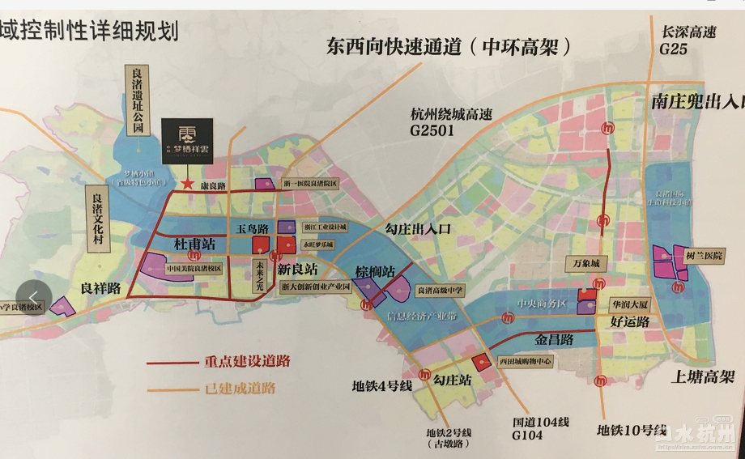

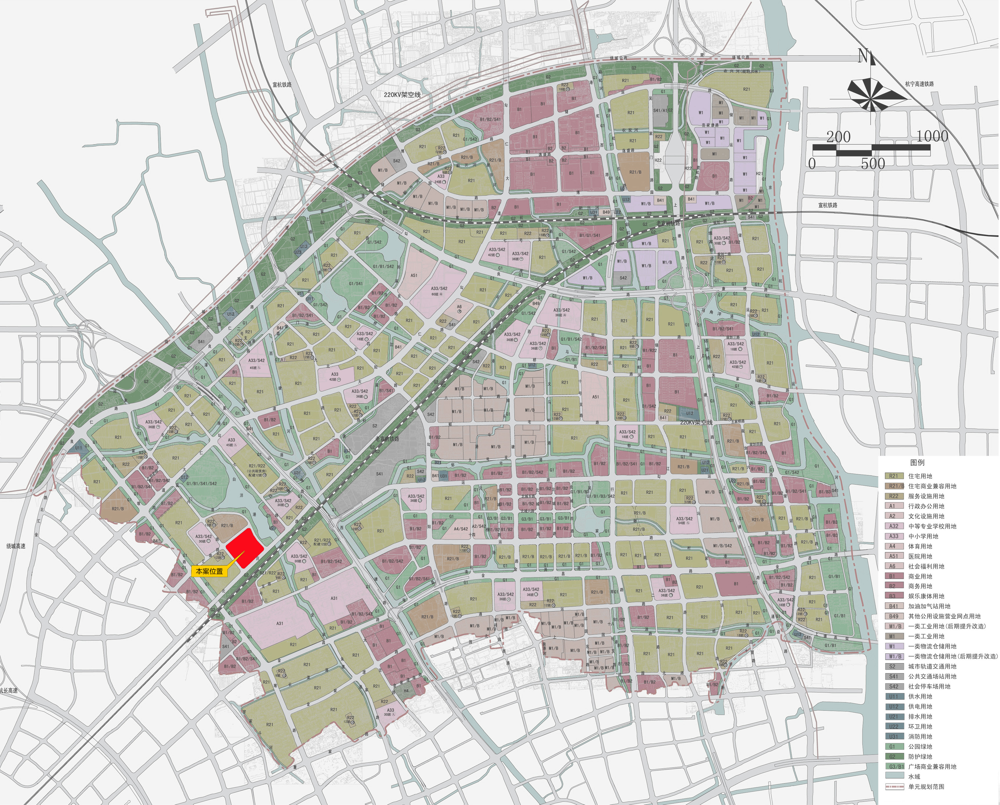

### 7.<a name="智慧网谷小镇">智慧网谷小镇</a>
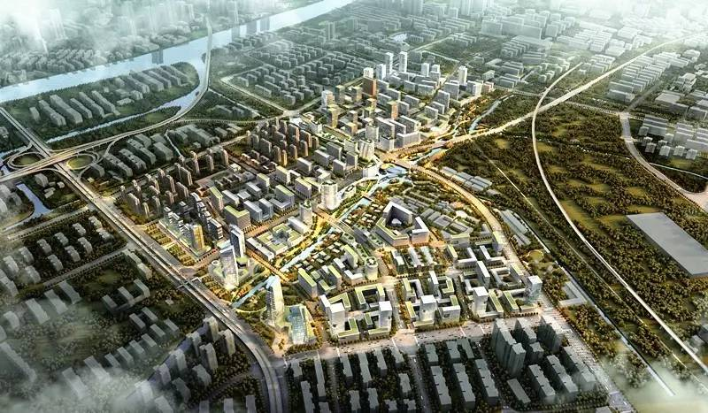

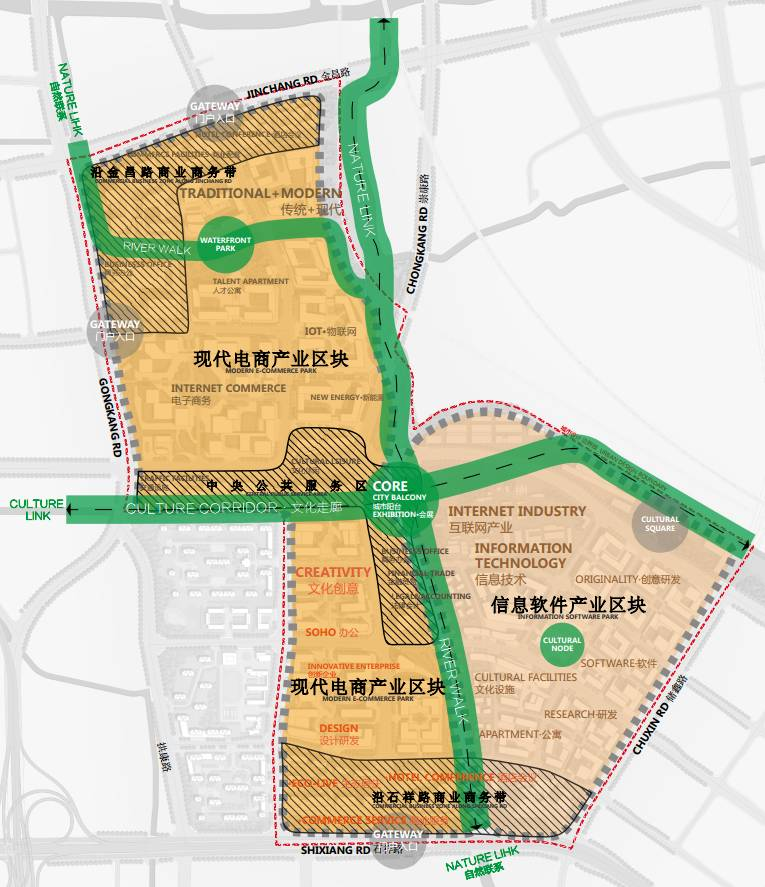

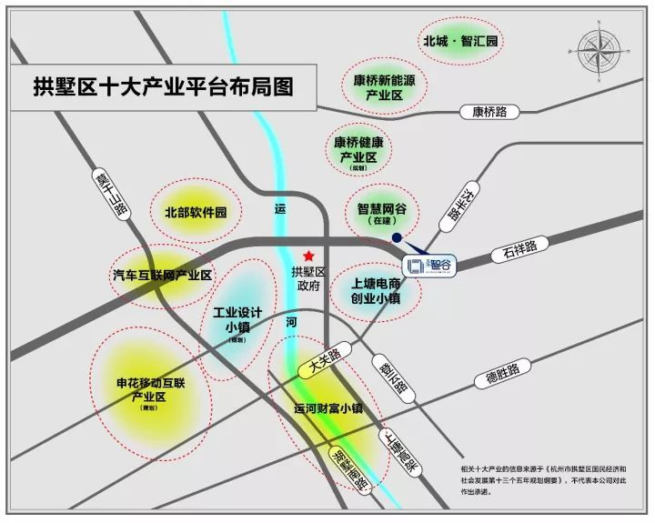
### 8.<a name="未来科技城金融岛">未来科技城金融岛</a>

## 十六: <a name="如果觉得不错随便赞赏下">如果觉得不错随便赞赏下</a>

